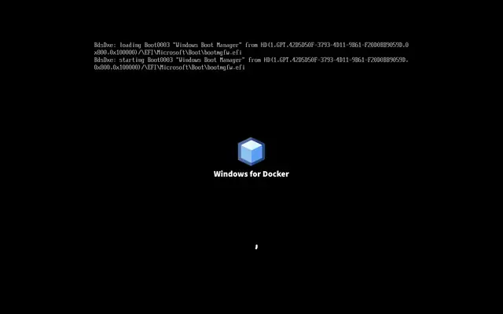

# wootc — Windows-hosted bootc Linux

<p align="center">
  <a href="https://tuna-os.github.io/wootc/e2e/latest/">
    
  </a>
  <br>
  <em>▶ Latest end-to-end run (sped-up): Windows 11 → wootc deployer → native Linux from <code>root.disk</code> → Windows 11. <a href="https://tuna-os.github.io/wootc/e2e/latest/">Click to play the full timelapse.</a></em>
</p>

<p align="center">
  <strong>Install a real, image-based Linux desktop from inside Windows — no repartitioning, no data loss, fully reversible.</strong>
</p>

---

wootc is a Windows-hosted installer for [bootc](https://github.com/containers/bootc)
Linux images. It writes a complete Linux system into `root.disk`, a single
sparse file on your existing Windows NTFS volume, and adds a one-shot Windows
Boot Manager entry that boots into it. There is **no repartitioning of the
Windows disk**, and uninstalling is deleting a folder and a boot entry.

It's a modern, Secure-Boot-friendly take on the classic [Wubi](https://en.wikipedia.org/wiki/Wubi_(software))
idea, built for container-native (OCI/ostree) Linux images and for people who
have never touched a partition editor.

## Why

> **North Star** — make it as easy as possible for *non-technical Windows
> users* to migrate to Linux **without losing any of their data**. Every
> decision is weighed against: *would a nervous Windows user get through this
> without fear or data loss?* Reversibility and data safety beat feature count;
> friendly language beats technical precision; **nothing permanent changes on
> the machine until Linux is proven working.**

Switching OS is scary because it usually means repartitioning, backups, and a
point of no return. wootc removes all three: Linux lives in a file next to
Windows, both boot from the same disk, and you decide if and when to make it
permanent.

## How it works

```
Windows 11  →  wootc.exe (arms the system)  →  reboot
            →  signed shim → GRUB → deployer initramfs
            →  fisherman: bootc install into root.disk
            →  reboot → native Linux, loop-mounted from root.disk
            →  (optional) reclaim the disk and remove Windows
```

1. **Arm (in Windows).** The GUI creates `C:\wootc\disks\root.disk`, stages a
   Microsoft/Fedora-signed `shim → GRUB → deployer` chain on the ESP, writes a
   credential vault, optionally slurps your Windows look, and sets a **one-shot**
   boot entry. Nothing else on the machine is touched.
2. **Deploy (one reboot).** Under Secure Boot, the signed chain launches the
   deployer initramfs, which mounts the NTFS volume, attaches `root.disk`, and
   uses [fisherman](https://github.com/projectbluefin/fisherman) to run
   `bootc install` — partitioning and populating the disk from the chosen OCI
   image, with optional LUKS/TPM2 encryption.
3. **Boot Linux.** A dracut hook (`99wootc-boot`) attaches `root.disk` on every
   boot and pivots into the native system. The OS itself is unmodified — the
   same image boots whether it lives in a file on NTFS or on a real partition.
4. **Commit (optional, later).** When you're ready to go Linux-only, graduate
   the system onto a native partition and reclaim the Windows space.

The Windows installer is a [Wails](https://wails.io) app (Go + web UI); the
deployer and migration tooling are POSIX shell and run inside the initramfs and
the target system.

## Features

| Area | What it does |
|---|---|
| **Guided installer** | Fixed-size GUI: pick an image, set user/hostname/disk, choose encryption. Live preflight (BitLocker, Fast Startup, UEFI, Secure Boot, free space). |
| **Image catalog** | GNOME / KDE / Niri / XFCE variants across Enterprise Linux, Fedora, Arch, and Debian bases. Override with a custom OCI ref or `C:\wootc\images.json`. |
| **Data safety first** | `root.disk` sits beside Windows; a one-shot boot entry means a failed deploy falls back to Windows. Reversible, partition-aware **uninstall**. |
| **BitLocker-safe (§3.5)** | Never forces decryption. Offers an unencrypted partition for Linux (create new or reuse) while C: stays encrypted. |
| **Disk encryption (§2.6)** | LUKS for the Linux root: TPM2 auto-unlock (default) or passphrase. |
| **User Data Bridge (§4)** | Brings your files, browser profiles (Firefox/Chrome/Edge), Steam libraries, and MS Office → LibreOffice settings across — honestly, with a consent tier that never copies secrets silently. |
| **Windows-Style Mode (§4.4)** | *Opt-in.* Wallpaper, accent color, keyboard layout, taskbar pins, and desktop shortcuts brought over on first login. Off by default — the image maker's look wins. |
| **WSL migration (§4.6)** | Copies a WSL user's dotfiles (public SSH keys only) and turns their installed packages into a Homebrew `Brewfile`. |
| **Bring your Windows over** | A Linux-side GUI to import data from a Windows install on **another disk** — second drive, external/USB, or a backup — unlocking **BitLocker** read-only (`cryptsetup bitlk`). |
| **Try in VM (§6)** | Boot `root.disk` in a QEMU window without rebooting, or build a fresh preview from an image and promote it to the real install if you like it. |
| **Themeable / lockable** | Partners can re-skin the installer and lock it to a single image family for a branded on-ramp. |

See [docs/SPEC.md](docs/SPEC.md) for the full specification and section numbers.

## Project status

**This is active, boot-path-focused development — not yet a released installer.**

Verified end-to-end on the KVM E2E rig (Windows 11 + TPM 2.0 + Secure Boot):

- ✅ **Arm (rung 1):** the real `wootc.exe` arms a virgin Windows VM over QGA —
  root disk, signed chain, one-shot BCD, `state.json = armed` (24/24).
- ✅ **Deploy:** the Secure Boot chain launches the deployer and fisherman lays
  down a full bootc image into `root.disk` — every post-deploy check passes
  (dracut hook, services, loop-root BLS args, ESP kernel-sync, `host-esp.conf`).
- ✅ **Native Phase-2 boot (rung 2):** the signed Windows BCD → shim → GRUB
  chain boots the installed Bluefin system from the NTFS-hosted `root.disk`.
  The initramfs mounts NTFS with the kernel driver, attaches the raw disk with
  `losetup`, resolves the root UUID, runs OSTree prepare-root, switches to the
  real deployment, reaches the graphical system, and exposes Linux QGA.
- ✅ **GUI + migration:** installer GUI (Playwright-tested), User Data Bridge
  and WSL/Office/Steam/browser bridges (unit-tested), external-disk import
  engine, Try-in-VM orchestration, Phase-3 planner.
- 🚧 **Graduate to native disk (Phase 3 / rung 3):** the automated VM now boots
  Phase 2, discovers and independently verifies a dedicated blank `/dev/sdb`,
  and reaches the guarded `bootc install to-disk` operation without touching
  Windows or `root.disk`. The remaining live verification is the privileged
  systemd dispatch and completed native-disk install; a GUI-driven full
  Phase-1 → Phase-2 → Phase-3 run follows once that rung is green.

Follow the verification ladder in [docs/milestones.md](docs/milestones.md).

### Build/test matrix

Live red/green status per combination, from the KVM E2E rig (laptop runners)
and the hosted-runner matrix (`.github/workflows/e2e-matrix.yml`). Legend:
✅ proven green · 🟡 in progress / partially proven · 🔴 known-red (tracked
issue) · ⚪ not yet run.

**Image family × phase** (Windows 11 Pro, Secure Boot + TPM 2.0):

| Image family | Backend / rootfs | Arm (P1) | Deploy | Phase-2 boot | Phase-3 graduate | GUI-driven full run |
|---|---|:--:|:--:|:--:|:--:|:--:|
| `bluefin:lts` | ostree · ext4-sealed | ✅ | ✅ | ✅ | ✅ (29/29) | 🟡 |
| `yellowfin:gnome` (EL10) | ostree · ext4-sealed | ✅ | ✅ | ✅ | ✅ | ⚪ |
| `bonito:gnome` (Fedora) | ostree · **xfs** (unsealed) | ✅ | 🟡 | ⚪ | ⚪ | ⚪ |
| `dakota` | composefs-native | ✅ | 🟡 | ⚪ | ⚪ | ⚪ |
| `marlin` (Arch) / `flounder` (Debian) | ostree · xfs (unsealed) | ✅ | 🟡 | ⚪ | ⚪ | ⚪ |

**Axes** (against the EL10 / `bluefin:lts` baseline):

| Axis | Status | Notes |
|---|:--:|---|
| Windows 11 Pro | ✅ | primary proven path |
| Windows 10 Pro | 🟡 | hosted re-validation after infra fixes |
| Home / Enterprise / LTSC (10 & 11) | ⚪ | matrix cases defined, not yet green on hosted |
| Root filesystem: `xfs` (unsealed) | ✅ | mounted with explicit `-t` (a typeless mount tried ext4 on xfs) |
| Root filesystem: `ext4` (sealed, fs-verity) | ✅ | proven sealed default |
| Root filesystem: `btrfs` (sealed) | 🔴 | formats fine, but ostree Phase-2 `sysroot.mount` times out — [#35](https://github.com/tuna-os/wootc/issues/35); opt-in via `wootc.filesystem=btrfs` |
| Encryption: none | ✅ | |
| Encryption: `tpm2-luks` | 🔴 | Phase-2 dracut regen fails on the LUKS root — [#33](https://github.com/tuna-os/wootc/issues/33) |
| BitLocker FDE (unencrypted-volume path) | 🔴 | deployer cannot find `root.disk` on the carved volume — [#34](https://github.com/tuna-os/wootc/issues/34) |

The full three-phase chain (Windows seed → deploy → Phase-2 bridge →
Phase-3 native disk → seeded file on the native disk) is **green end-to-end
on `bluefin:lts`** via the script path; the same chain driven entirely
through the real `wootc.exe` GUI is in active validation.

## Safety model

- **Nothing permanent until proven.** The first boot into the deployer is a
  one-shot entry; the default boot order stays Windows until Linux is verified.
- **The source is never mutated.** External-disk and BitLocker imports mount
  **read-only**; BitLocker volumes are never decrypted in place.
- **Secrets stay put.** Passwords, private keys, tokens, and credential stores
  are never copied silently — you sign in again where it matters.
- **Reversible uninstall.** Removes the boot entry and `C:\wootc\`, and can
  reclaim a dedicated Linux partition, restoring Windows to its prior state.

## Architecture

wootc keeps a deliberate boundary between **generic Windows→Linux migration
machinery** and the **bootc-specific provisioner**, so the design can be adapted
to other distributions and deployment methods. The seam is documented in
[docs/architecture-boundary.md](docs/architecture-boundary.md); `deploy.sh`
marks its provisioner region explicitly.

```
app/                     Wails Windows installer (Go backend + web UI)
payload/deployer/        one-shot deployer initramfs + deploy.sh
payload/migration/       User Data Bridge, WSL, external-disk import, Phase-3
payload/builder/         Try-in-VM Alpine builder (headless OCI→disk)
payload/wubildr/         reproducible custom GRUB EFI build
platform/dracut/99wootc-boot/   Phase-2 loop-root attach hook
platform/grub/           external GRUB configuration
fisherman/               bootc install / partitioning (submodule, tuna-os fork)
tests/                   e2e (KVM Windows 11), gui (Playwright), migration
docs/                    SPEC, boundary, milestones, walkthroughs
```

## Build and test

```bash
just build                     # deployer initramfs + custom GRUB

# GUI unit tests (Playwright over the real frontend bundle, mocked backend)
cd tests/gui && npx playwright test

# Migration bridge tests (containerized, no Windows needed)
bash tests/migration/test-bridge.sh
```

### End-to-end (KVM)

The E2E harness drives a Windows 11 VM (via [dockur/windows](https://github.com/dockur/windows))
over the QEMU Guest Agent — no guest networking required. It needs a host with
KVM, UEFI Secure Boot, and TPM 2.0.

```bash
just remote-sync               # push + reset a runner to origin/main
just remote-e2e                # fresh install + deploy (~30 min)
just remote-e2e-quick          # reuse the installed disk (~5 min)

just remote-logs               # tail the run
just remote-serial             # watch the deployer serial console
just remote-status             # grep PASS/FAIL markers
```

Every E2E run records a sped-up timelapse to `tests/e2e/storage/artifacts/<run>/video/`.
To refresh the [walkthrough](https://tuna-os.github.io/wootc/e2e/latest/) at the top
of this README, publish a passing run's clip:

```bash
tests/e2e/publish-visual.sh --from-host himachal   # or a local artifact dir
git add pages && git commit -m 'docs: refresh E2E walkthrough' && git push origin main
```

A GitHub-hosted workflow (`.github/workflows/pages.yml`) then deploys it to Pages —
no self-hosted runner required. The README hero is a committed relative path, so it
renders inline on GitHub even before Pages redeploys.

## Documentation

- [docs/SPEC.md](docs/SPEC.md) — the full specification
- [docs/architecture-boundary.md](docs/architecture-boundary.md) — the bootc / generic seam
- [docs/milestones.md](docs/milestones.md) — the verification ladder
- [docs/gui-walkthrough.md](docs/gui-walkthrough.md) — installer screenshots
- [docs/non-bootc-adoption.md](docs/non-bootc-adoption.md) — "what if I don't want bootc?"
- [CONTEXT.md](CONTEXT.md) — project vocabulary

## License

The Windows installer components derived from [WubiUEFI](https://github.com/hakuna-m/wubiuefi)
are **GPL-2.0**; the deployer initramfs and GRUB configuration are **MIT**.
fisherman, bootc, bootupd, podman, and skopeo are separate binaries under their
own (Apache-2.0) licenses, invoked over a process boundary. See
[docs/SPEC.md](docs/SPEC.md#7-license) for details.
