# Branded installer walkthroughs

Automated screenshot walkthroughs for every brand build
(docs/branding-and-distribution.md). These are **generated, not curated**:
`tests/gui/branded-walkthrough.spec.js` assembles each brand's real embedded
assets from `app/branding/<brand>/` — the same brand.json, logo, typeface
and theme a `-X main.brandID=<brand>` binary compiles in — drives the real
frontend bundle through the four journey screens, and asserts on every one
that the build wears its own name, mark and look (and, for branded builds,
never the word "wootc"). Re-running the Playwright suite refreshes every
image below.

**Live video walkthroughs** — every distribution that has passed a full
GUI-driven E2E gets its own timelapse (a real Windows VM installing that
image through the real GUI, migrating data, and returning to Windows) in
the gallery at **https://tuna-os.github.io/wootc/e2e/** ; the most recent
green run of any image is always at
[/e2e/latest/](https://tuna-os.github.io/wootc/e2e/latest/). Cuts publish
automatically on green (`e2e-gui.yml`), one directory per distribution.

The journey per brand: **launchpad** (the brand's catalog, its default
pre-selected) → **progress** (the reassurance screen in the brand's look) →
**done** (celebrating with the brand's own mark) → **manage** (the branded
way back in — "Restart into …" — and the way out).

## Bazzite — "The next generation of Linux gaming"

| | |
|---|---|
| 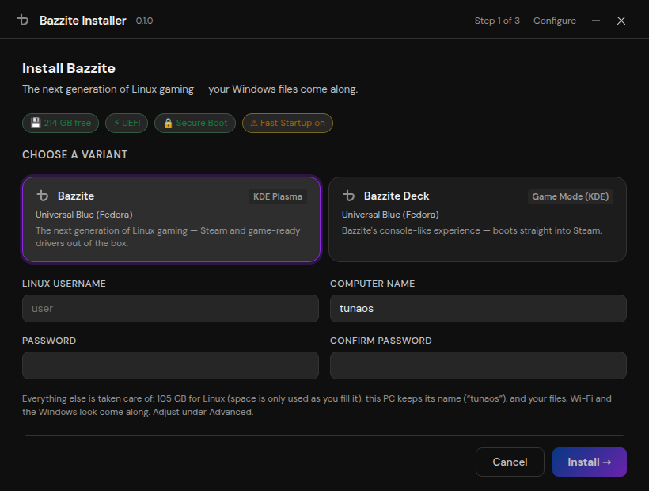 | 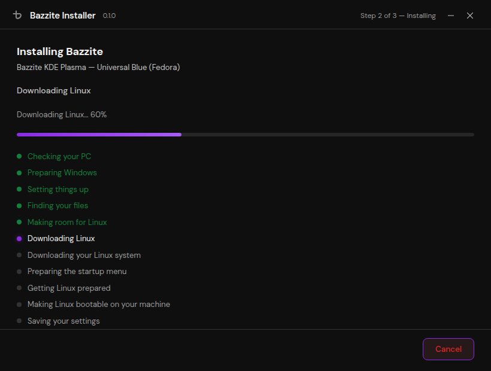 |
| 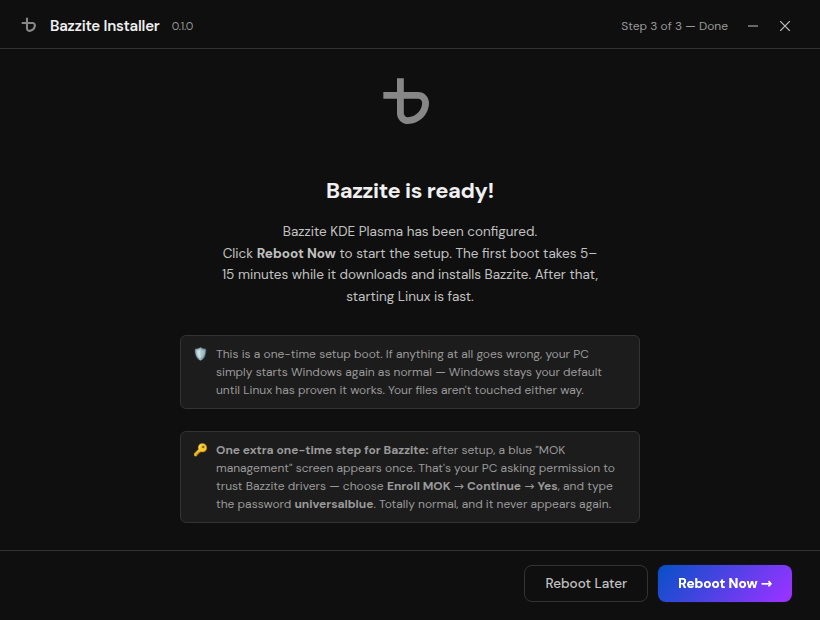 |  |

## Bluefin — "The next generation Linux workstation"

| | |
|---|---|
| 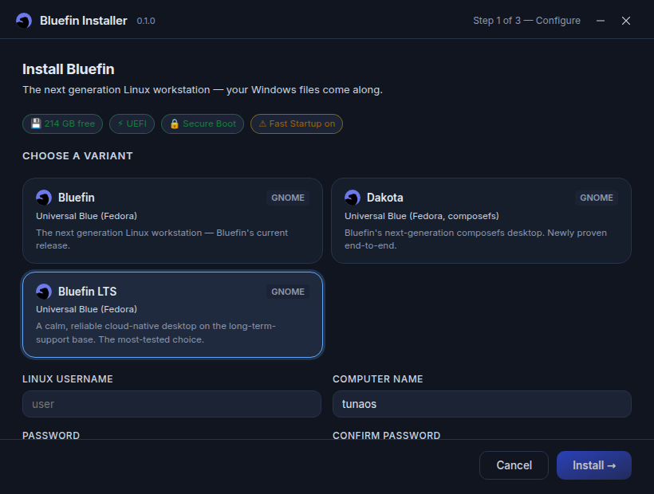 | 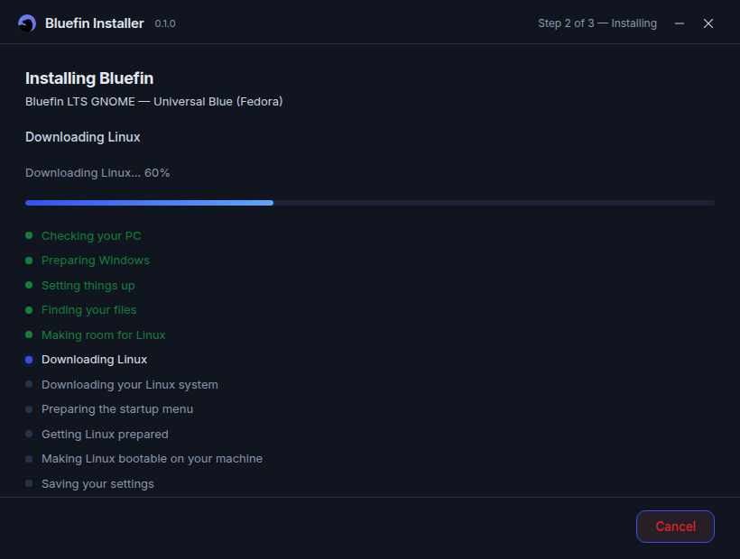 |
|  |  |

## Aurora — "Simply delightful"

| | |
|---|---|
| 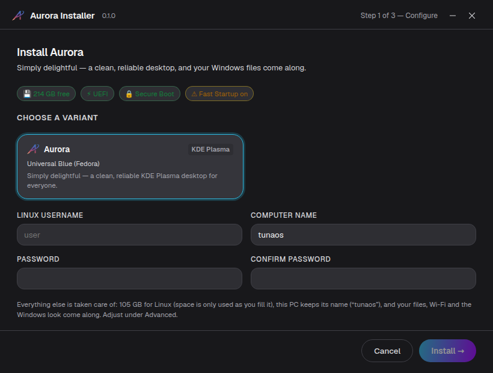 | 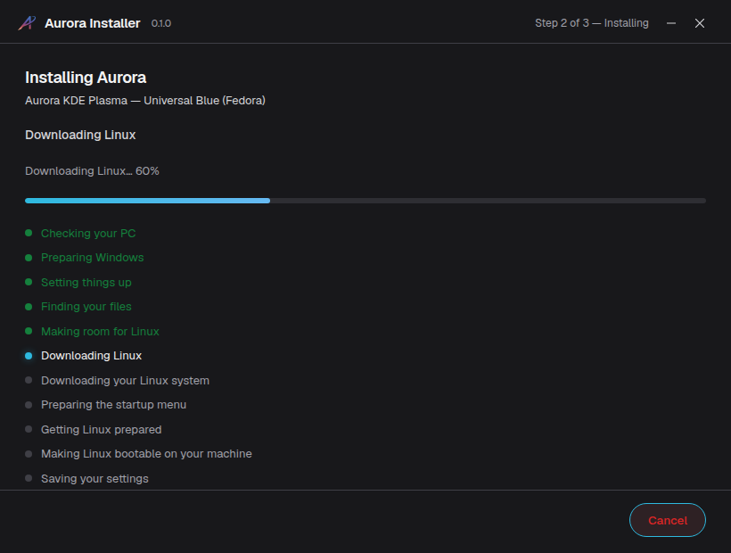 |
|  |  |

## TunaOS

| | |
|---|---|
| 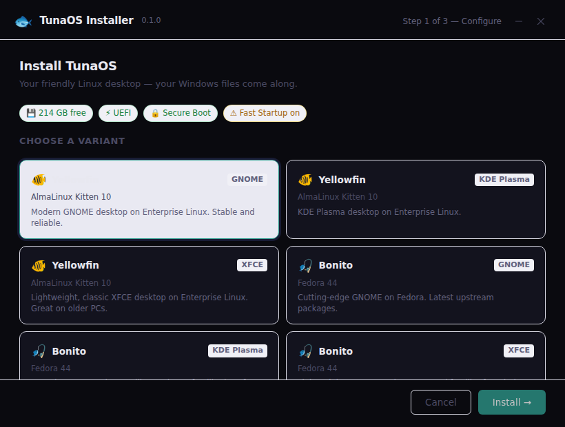 | 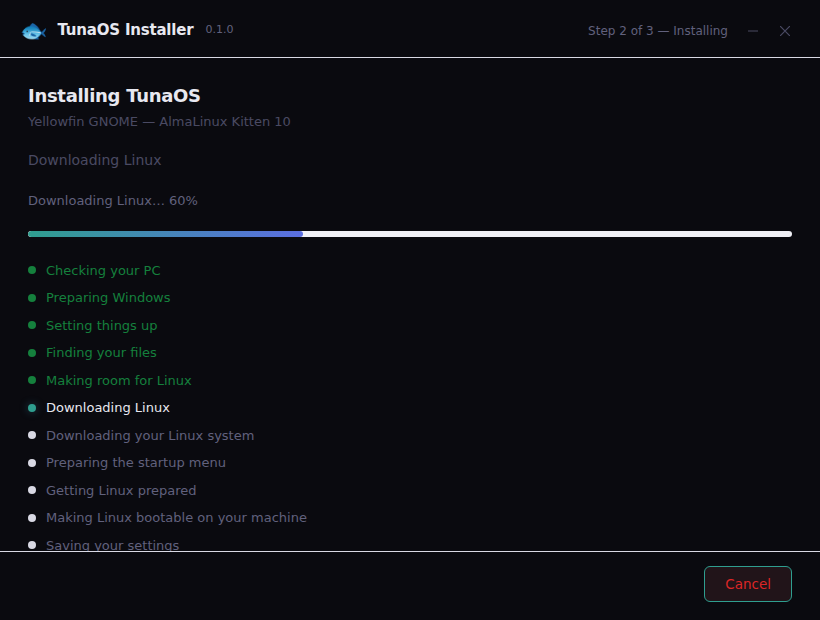 |
|  |  |

## wootc (generic)

The un-branded engine, as shipped today — also covered by the main
[GUI walkthrough](gui-walkthrough.md).

| | |
|---|---|
| 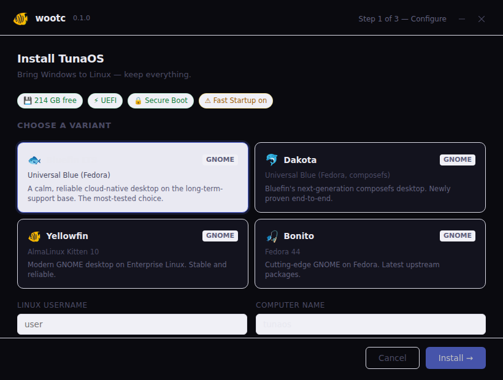 |  |
| 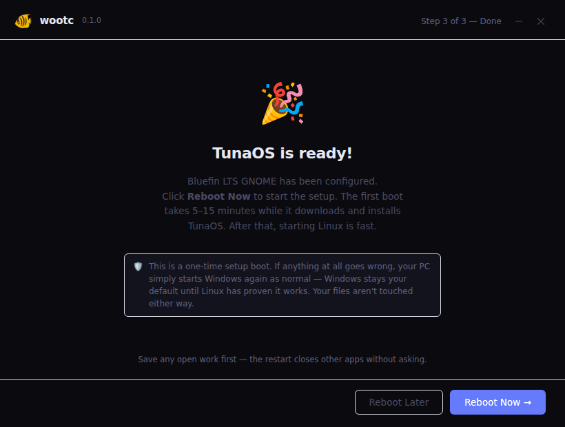 |  |
