# Branded installer walkthroughs

This page has automated screenshot walkthroughs for each brand build
(`docs/branding-and-distribution.md`). A test makes these images; nobody
selects them by hand. `tests/gui/branded-walkthrough.spec.js` assembles each
brand's real embedded assets from `app/branding/<brand>/`. These are the same
brand.json, logo, typeface and theme that a `-X main.brandID=<brand>` binary
compiles in.

The test drives the real frontend bundle through the four
journey screens. On each screen, it asserts that the build shows its own
name, mark and look. A branded build must never show the word "wootc".
When you run the Playwright suite again, it refreshes each image below.

**Live video walkthroughs:** each distribution that passed a full
GUI-driven E2E has its own timelapse in the gallery at
**https://tuna-os.github.io/wootc/e2e/** . In each timelapse, a real Windows
VM installs that image through the real GUI. It then moves the user data and
goes back to Windows. The most recent green run of each image is always at
[/e2e/latest/](https://tuna-os.github.io/wootc/e2e/latest/). Cuts publish
automatically on green (`e2e-gui.yml`), one directory per distribution.

Each brand has the same journey:

1. **launchpad**: the brand's catalog, with its default image selected.
2. **progress**: the reassurance screen in the brand's look.
3. **done**: the success screen with the brand's own mark.
4. **manage**: the branded way back in ("Restart into …") and the way out.

## Bazzite — "The next generation of Linux gaming"

| | |
|---|---|
| 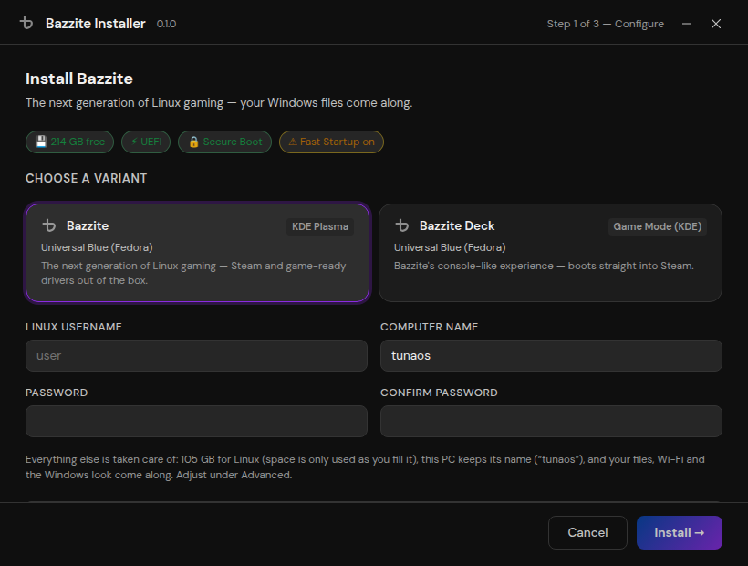 | 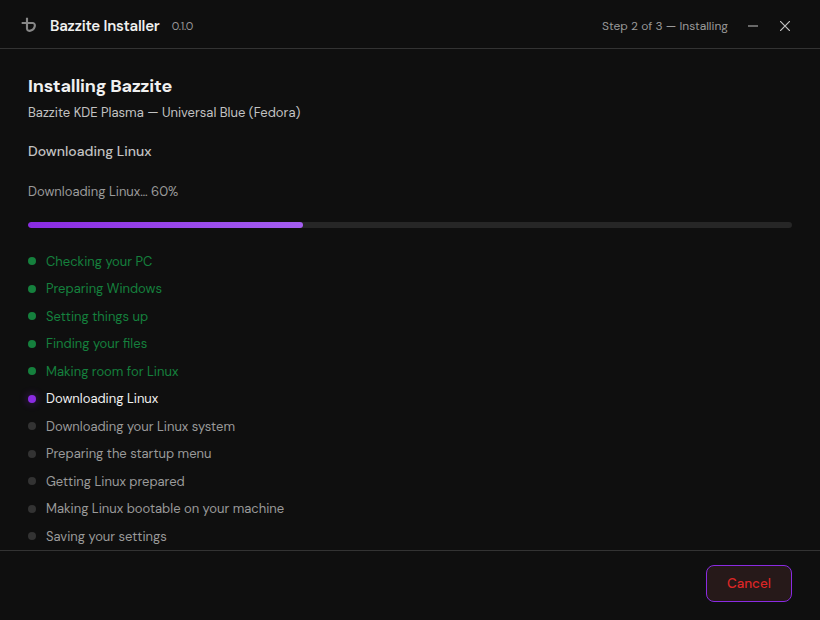 |
| 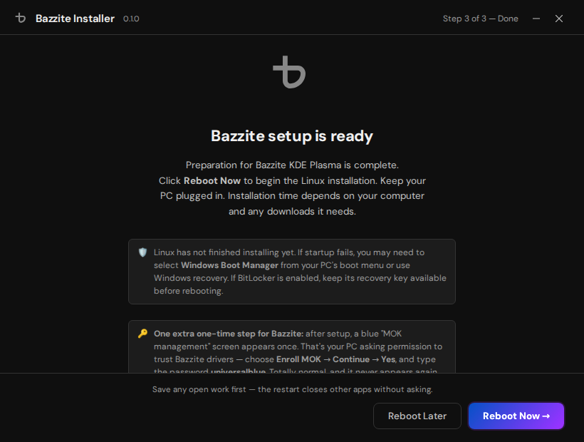 |  |

## Bluefin — "The next generation Linux workstation"

| | |
|---|---|
| 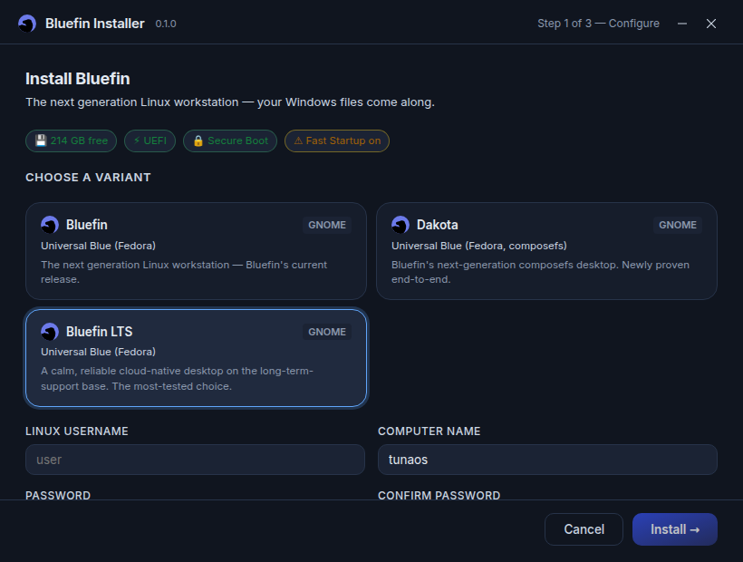 | 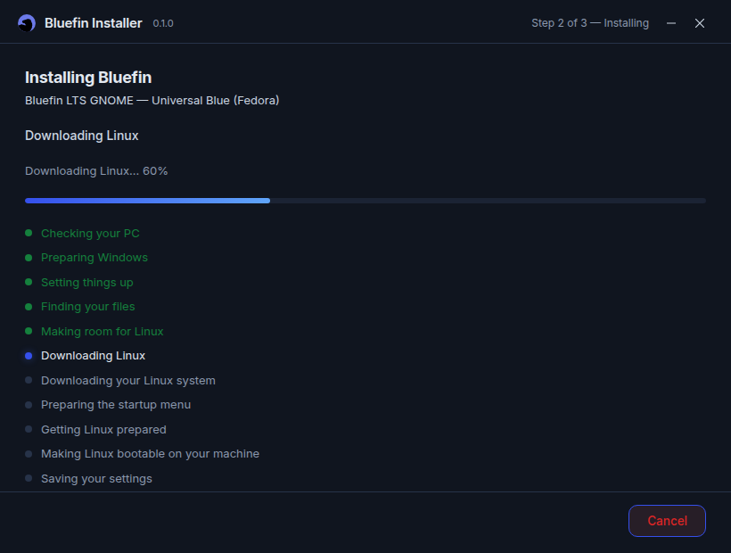 |
| 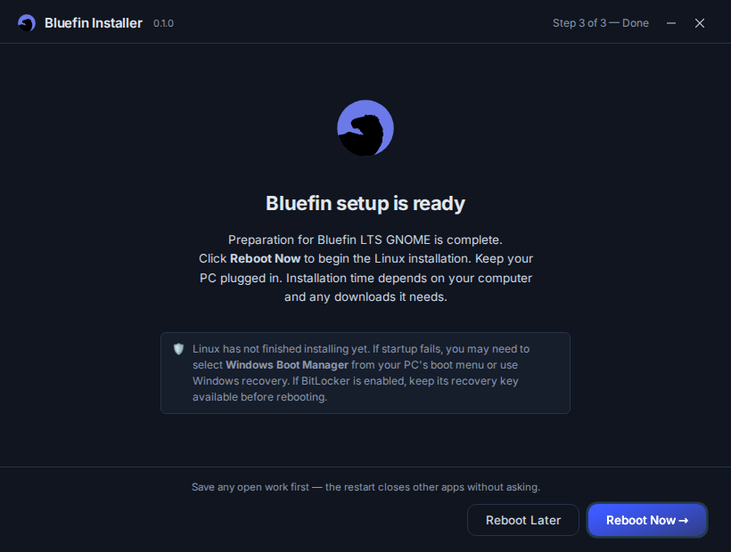 |  |

## Aurora — "Simply delightful"

| | |
|---|---|
| 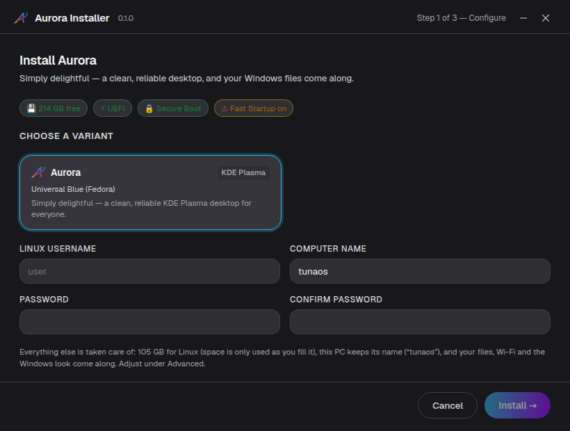 | 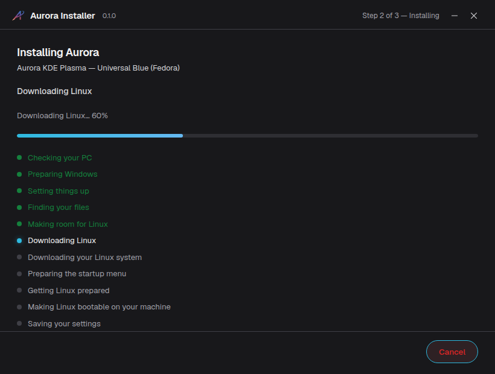 |
| 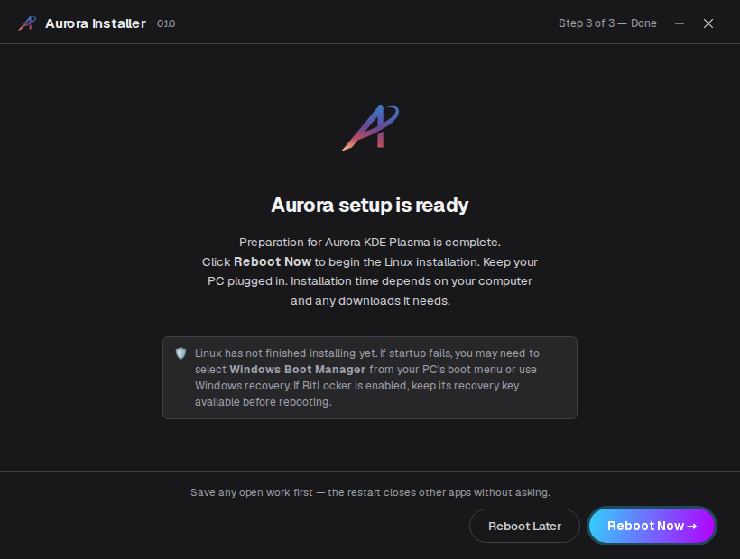 |  |

## TunaOS

| | |
|---|---|
| 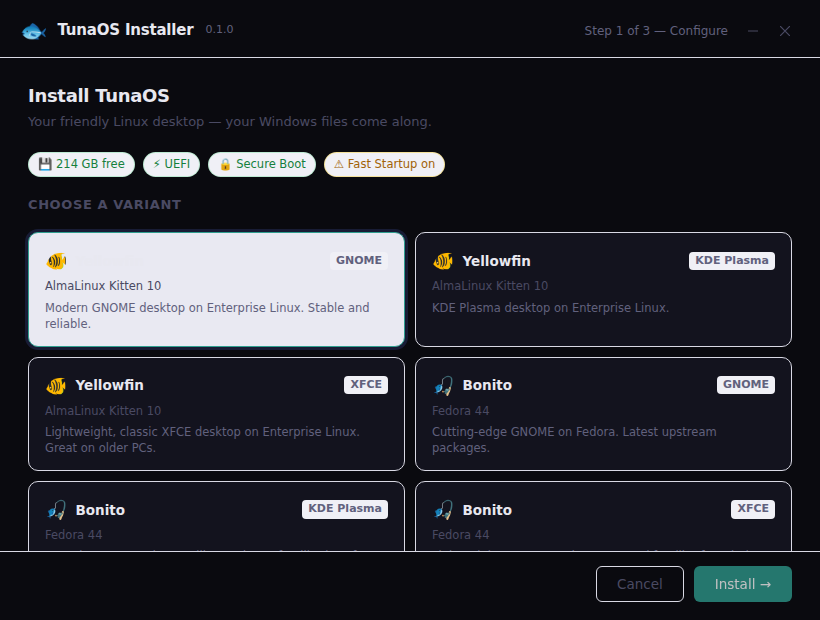 | 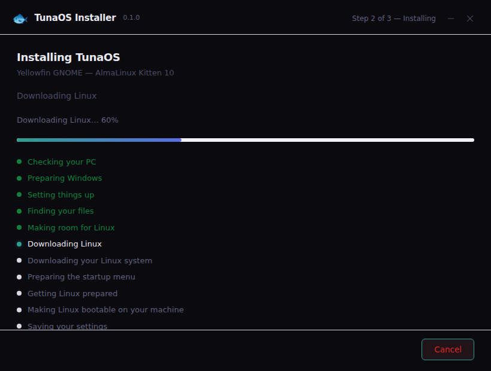 |
| 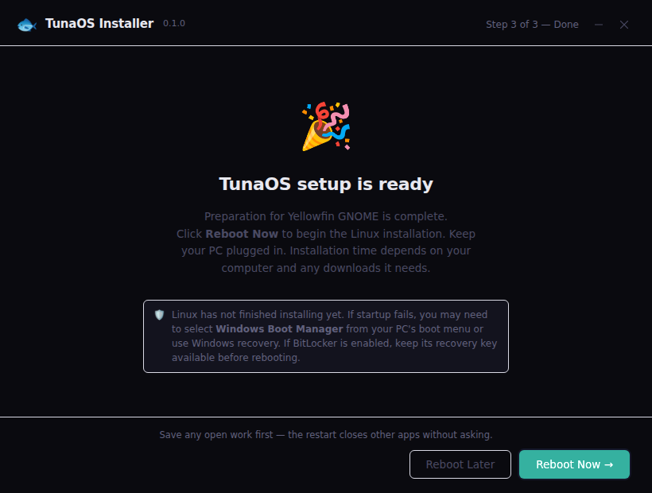 |  |

## wootc (generic)

The un-branded engine, as shipped today — also covered by the main
[GUI walkthrough](gui-walkthrough.md).

| | |
|---|---|
| 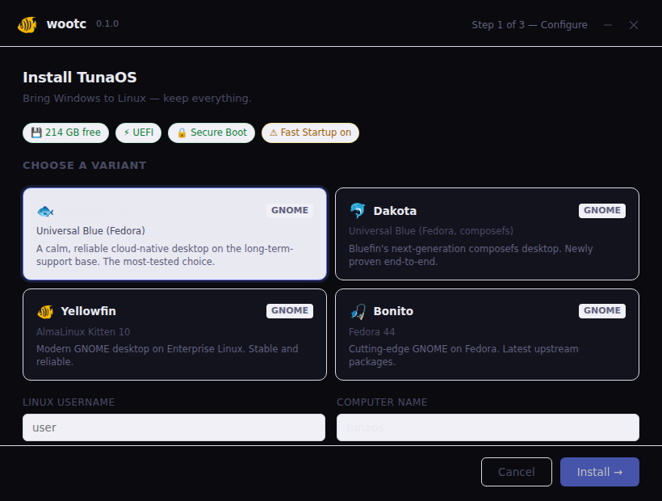 |  |
| 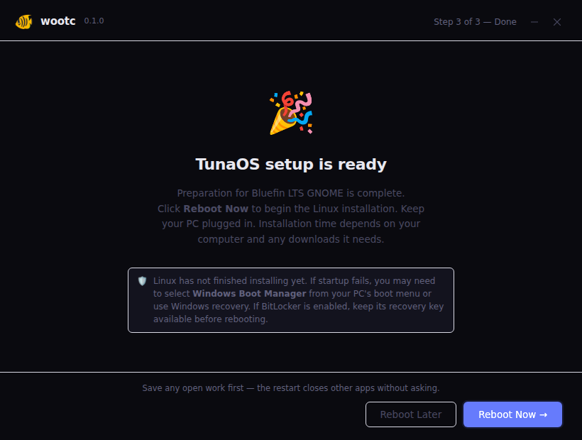 |  |
