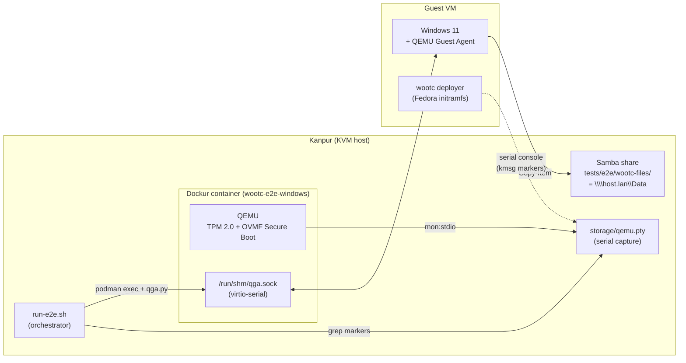
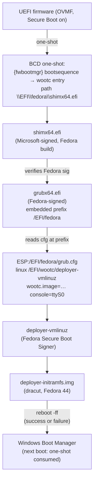
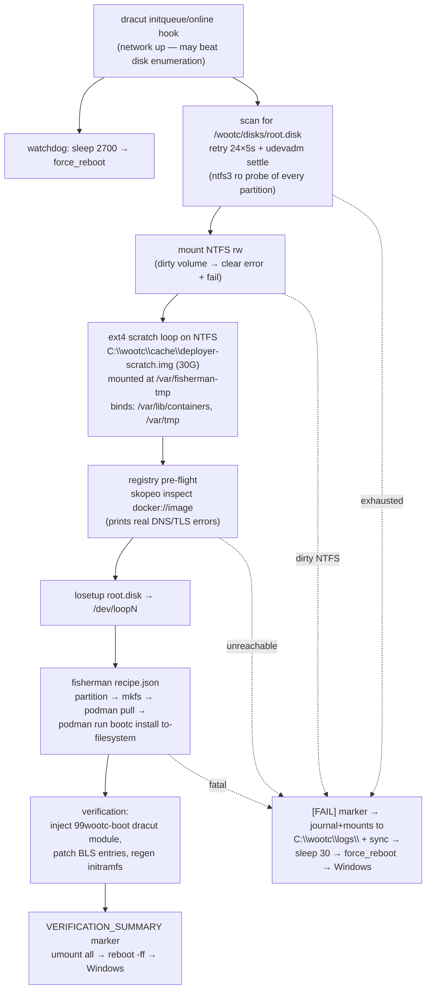
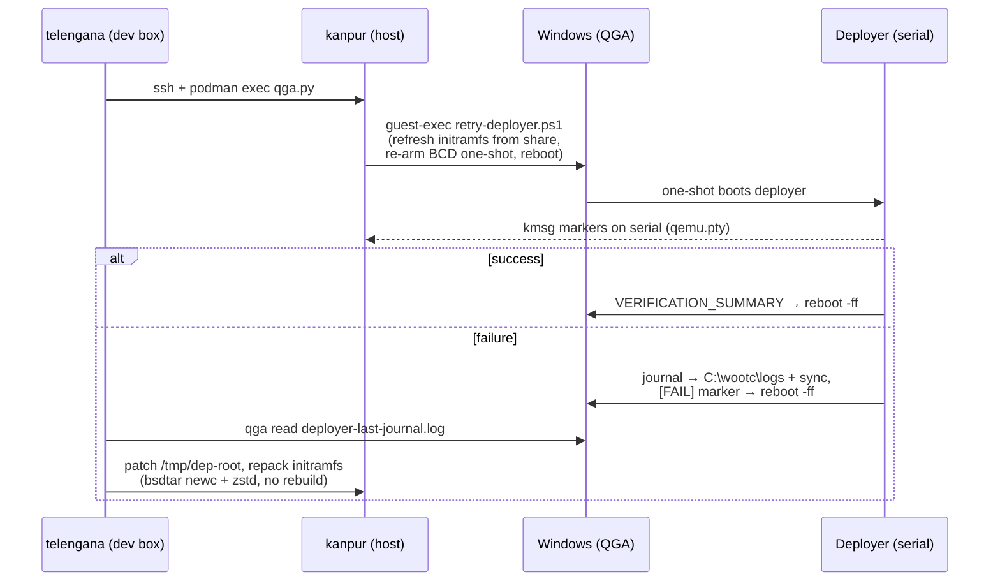

# wootc E2E Architecture — Phase 2 Boot Chain

How the E2E test drives a real Windows 11 VM (TPM + Secure Boot) through the
full wootc flow: OEM install → deployer boot → fisherman deployment →
return to Windows. Everything here was validated live on the Kanpur KVM
host, 2026-07-15/16.

## The big picture

Two control planes, one per OS:

| Guest state | Control plane | Direction |
|---|---|---|
| Windows | QGA (`guest-exec` PowerShell, `guest-file-read`) | bidirectional |
| Deployer (Linux initramfs) | Serial console only | **read-only** |

The deployer has no input path (container stdin is closed), which drives two
design rules: every failure must **reboot back to Windows** on its own, and
every diagnostic must be **pushed out** (serial kmsg markers + journal
persisted to NTFS) rather than pulled interactively.

## Secure Boot chain (validated)

Hard-won constraints baked into this design:

- **grub.cfg must live at `/EFI/fedora/grub.cfg`** — the signed GRUB's
  embedded prefix. A cfg in `\EFI\wootc\` is never read.
- **No external GRUB modules.** Under Secure Boot, GRUB refuses unsigned
  `.mod` files. `fat`, `part_gpt`, `search`, `linux`, `loopback` are
  embedded; **`ntfs` is not** — so GRUB can read the FAT32 ESP but never the
  NTFS volume. Deployer kernel + initramfs therefore live **on the ESP**
  (256 MB, holds the ~148 MB pair).
- **The kernel must be signed** (shim verifies it). The stock Fedora
  deployer kernel passes; an unsigned custom kernel would not.
- `$root` defaults to the device GRUB loaded from (the ESP) — no
  `set root=(hd0,gptN)` guessing.
- The BCD entry is the one `setup-wootc.ps1` created (GUID in
  `C:\wootc\install\bcd-guid.txt`), repointed from unsigned `wubildr.efi`
  to the shim. The runner re-arms this same GUID for the Phase-2 boot.

## Deployer internals

Why the scratch loop exists: the initramfs root is **ramfs** — a multi-GB
image pull there exhausts RAM (8 G VM). fisherman does its heavy I/O under
`/var/fisherman-tmp` (podman `--root`, OCI cache, bootc `/var/tmp` bind), and
overlay needs a real POSIX filesystem, so the deployer backs that path with
an ext4 loop file on the Windows partition and deletes it afterwards.

Initramfs contents that podman/fisherman hard-require (all missing from the
original build, each found by a failed run):

| Requirement | Failure it caused |
|---|---|
| `sfdisk`, `mkfs.fat`, `partprobe`, `blockdev`, `wipefs`, … | `fisherman: fatal: missing required host tool` |
| `/etc/containers/policy.json`, `registries.conf`, CA bundle | `podman pull` exit 125 (instant) |
| **`conmon` + `crun`** | `podman` exit 125: *could not find a working conmon binary* (also silently downgraded the overlay probe to VFS) |
| `truncate`, `install`, `mountpoint`, `udevadm`, `jq`, `sync` | script-level failures / lost logs |

## Failure & recovery loop (E2E debugging)

Operational invariants (violations cost a debug cycle each):

- **Never hard-kill the VM while the deployer has NTFS mounted rw** — the
  dirty bit sticks across normal Windows boots and blocks every later rw
  mount. Recovery: `Repair-Volume -DriveLetter C -OfflineScanAndFix` +
  reboot (autochk), verify with `fsutil dirty query C:`.
- **`reboot -f` is `systemctl reboot -f`** and hangs once dracut enters
  emergency mode (the gpt-auto root-device timeout fires ~45 s in, long
  before any deployer step finishes). Only `reboot -ff` / sysrq is safe.
- **stdout of a sourced initqueue hook does not reach the serial console**
  reliably — only `/dev/kmsg` writes and stderr do.
- The hook is **sourced under `set -e`**: capture exit codes as
  `status=0; cmd || status=$?`.

## Known limitation — Phase-2 Linux boot under Secure Boot

The runner's final step re-arms the wootc BCD entry to boot the *installed*
OS from inside `root.disk`. The wubildr design (GRUB loop-mounts root.disk
over NTFS) cannot work with the signed GRUB: `ntfs.mod` is unsigned and the
signed image doesn't embed it. Options, per SPEC §1.2:

1. **ESP kernel-sync** (systemd-boot-style): deployer copies the installed
   kernel+initramfs to the ESP and writes a GRUB entry with the loop-root
   cmdline; the installed initramfs (99wootc-boot) mounts NTFS itself via
   kernel ntfs3 — no GRUB NTFS needed. Fits the existing chain unchanged.
2. **MOK-enroll a custom signed GRUB** (wubildr with ntfs+loopback):
   preserves kernel-inside-root.disk loading but adds a one-time MokManager
   enrollment step.

(1) is recommended for the E2E and matches the OSTree sync-hook design
already specified for the systemd-boot path.
