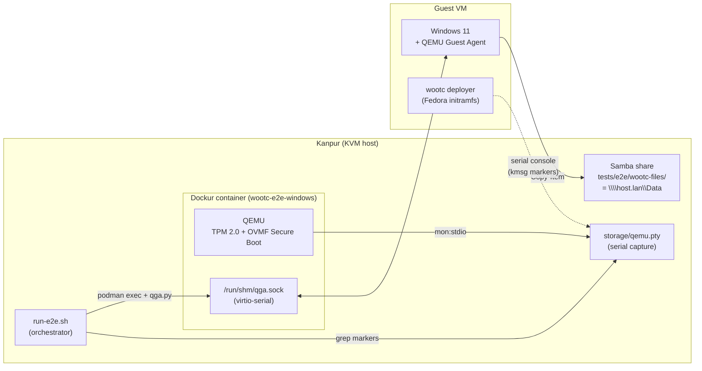
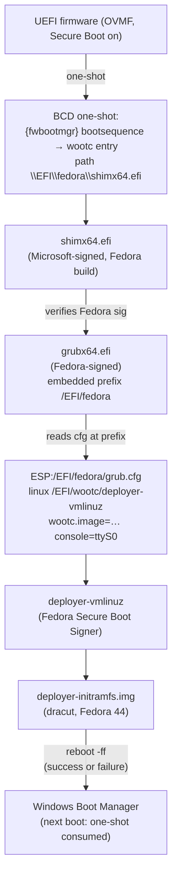
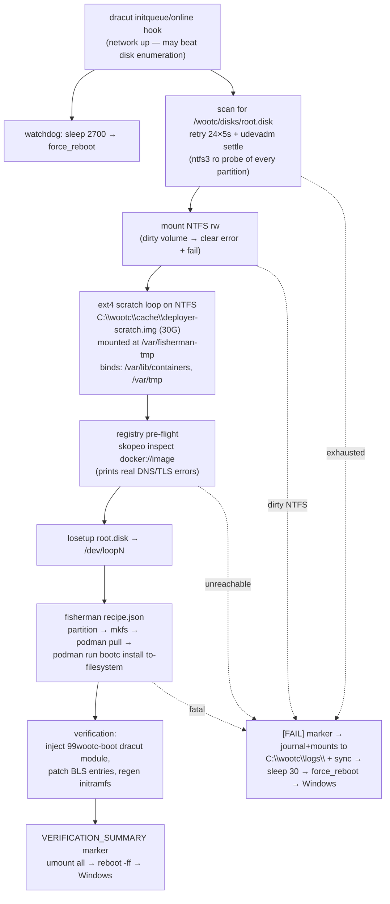
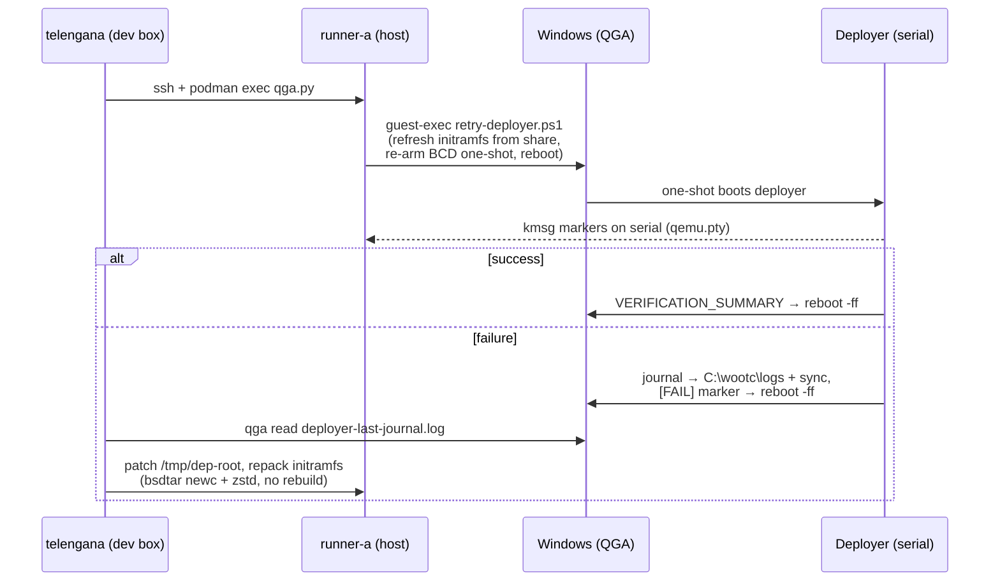
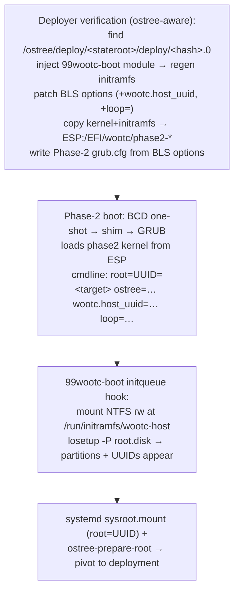

# wootc E2E Architecture — Phase 2 Boot Chain

This page describes the native-cycle harness: Windows preparation, deployer boot,
Linux deployment and a Windows return. The diagrams record the Kanpur design from
2026-07-15/16. They do not prove Linux inside Windows or the WinUI journey.
Use [current status](status.md#buildtest-matrix) for dated run evidence.
The module descriptions below match the source as of 2026-09-27.

## The big picture

```mermaid
flowchart LR
    subgraph host["Kanpur (KVM host)"]
        runner["run-e2e.sh<br/>(orchestrator)"]
        share["Samba share<br/>tests/e2e/wootc-files/<br/>= \\\\host.lan\\Data"]
        pty["storage/qemu.pty<br/>(serial capture)"]
        subgraph container["Dockur container (wootc-e2e-windows)"]
            qemu["QEMU<br/>TPM 2.0 + OVMF Secure Boot"]
            qga_sock["/run/shm/qga.sock<br/>(virtio-serial)"]
        end
    end
    subgraph vm["Guest VM"]
        win["Windows 11<br/>+ QEMU Guest Agent"]
        dep["wootc deployer<br/>(Fedora initramfs)"]
    end
    runner -->|"podman exec + qga.py"| qga_sock
    qga_sock <--> win
    win -->|"Copy-Item"| share
    qemu -->|"mon:stdio"| pty
    runner -->|"grep markers"| pty
    dep -.->|"serial console<br/>(kmsg markers)"| pty
```

Two control planes, one per OS:

| Guest state | Control plane | Direction |
|---|---|---|
| Windows | QGA (`guest-exec` PowerShell as SYSTEM, `guest-file-read`) | bidirectional |
| Deployer / Phase-2 Linux | QGA (`guest-exec` `/bin/sh`, `guest-file-read`) + serial console | bidirectional (QGA) · read-only (serial) |

Both guests use the same virtio-serial port for QGA.
`deploy-hook.sh` starts `qemu-ga` in the deployer initramfs.
`MGMT_KARG` in `deploy.sh` requests `qemu-guest-agent.service` in the installed system.
That request alone does not prove the service exists or runs.
The runner inspects Phase 2 and controls Phase 3 through QGA.

The first deployer run needs no interactive input.
Its design calls for a Windows return on failure and persistent diagnostics:
records on the serial console and a journal on NTFS.

**Liveness vs identity.** `guest-ping` proves that an agent answers.
It does not identify the OS.

Actions need a successful command with a positive OS result.
`qga_windows_probe` checks `$env:OS` for `Windows_NT`.
`qga_linux_probe` checks `uname -s` for Linux.
`tests/e2e/lib/qga-transport.sh` defines these probes; `run-e2e.sh` uses them.
Neither probe accepts a token when its command fails.

Legacy GUI observers still need review under #383.

## Secure Boot chain (validated)

```mermaid
flowchart TD
    fw["UEFI firmware (OVMF, Secure Boot on)"]
    bcd["BCD one-shot:<br/>{fwbootmgr} bootsequence → wootc entry<br/>path \\EFI\\fedora\\shimx64.efi"]
    shim["shimx64.efi<br/>(Microsoft-signed, Fedora build)"]
    grub["grubx64.efi<br/>(Fedora-signed)<br/>embedded prefix /EFI/fedora"]
    cfg["ESP:/EFI/fedora/grub.cfg<br/>linux /EFI/wootc/deployer-vmlinuz<br/>wootc.image=… console=ttyS0"]
    kernel["deployer-vmlinuz<br/>(Fedora Secure Boot Signer)"]
    initrd["deployer-initramfs.img<br/>(dracut, Fedora 44)"]
    winback["Windows Boot Manager<br/>(next boot: one-shot consumed)"]

    fw -->|"one-shot"| bcd --> shim -->|"verifies Fedora sig"| grub -->|"reads cfg at prefix"| cfg
    cfg --> kernel --> initrd
    initrd -->|"reboot -ff<br/>(success or failure)"| winback
```

Hard-won constraints baked into this design:

- **grub.cfg must live at `/EFI/fedora/grub.cfg`** — the signed GRUB's
  embedded prefix. A cfg in `\EFI\wootc\` is never read.
- **No external GRUB modules.** Secure Boot blocks unsigned `.mod` files.
  This Fedora GRUB contains `fat`, `part_gpt`, `search`, `linux` and `loopback`.
  It has no embedded `ntfs` module, so this chain reads the FAT32 ESP.
  The deployer kernel and initramfs live **on the ESP**.
  The historical 256 MB ESP held the about 148 MB pair.
- **The kernel needs a trusted signature**; shim verifies it.
  The historical run used the Fedora kernel for the deployer.
  This check rejects an unsigned custom kernel.
- `$root` defaults to the ESP from which GRUB loaded.
  Do not guess a disk number with `set root=(hd0,gptN)`.
- The BCD entry is the one `setup-wootc.ps1` created (GUID in
  `C:\wootc\install\bcd-guid.txt`), repointed from unsigned `wubildr.efi`
  to the shim. The runner re-arms this same GUID for the Phase-2 boot.

## Deployer internals

```mermaid
flowchart TD
    online["dracut initqueue/online hook<br/>(network up — may beat disk enumeration)"]
    wd["watchdog: sleep 2700 → force_reboot"]
    scan["scan for /wootc/disks/root.disk<br/>retry 24×5s + udevadm settle<br/>(ntfs3 ro probe of every partition)"]
    mnt["mount NTFS rw<br/>(dirty volume → clear error + fail)"]
    scratch["ext4 scratch loop on NTFS<br/>C:\\wootc\\cache\\deployer-scratch.img (30G)<br/>mounted at /var/fisherman-tmp<br/>binds: /var/lib/containers, /var/tmp"]
    preflight["registry pre-flight<br/>skopeo inspect docker://image<br/>(prints real DNS/TLS errors)"]
    loop["losetup root.disk → /dev/loopN"]
    fish["fisherman recipe.json<br/>partition → mkfs → podman pull →<br/>podman run bootc install to-filesystem"]
    verify["verification:<br/>inject 99wootc-boot dracut module,<br/>patch BLS entries, regen initramfs"]
    ok["VERIFICATION_SUMMARY marker<br/>umount all → reboot -ff → Windows"]
    fail["[FAIL] marker → journal+mounts to<br/>C:\\wootc\\logs\\ + sync →<br/>sleep 30 → force_reboot → Windows"]

    online --> wd
    online --> scan --> mnt --> scratch --> preflight --> loop --> fish --> verify --> ok
    scan -.->|"exhausted"| fail
    mnt -.->|"dirty NTFS"| fail
    preflight -.->|"unreachable"| fail
    fish -.->|"fatal"| fail
```

Why the scratch loop exists: the initramfs root is **ramfs** — a multi-GB
image pull there exhausts RAM (8 G VM). fisherman uses `/var/fisherman-tmp` for heavy I/O:
podman `--root`, the OCI cache and the bootc `/var/tmp` bind.
Overlay needs a POSIX filesystem.
The deployer uses an ext4 loop file on the Windows partition, then deletes that file.

The initramfs in the original build lacked tools and files that podman and fisherman need.
Failed runs found each omission:

| Requirement | Failure it caused |
|---|---|
| `sfdisk`, `mkfs.fat`, `partprobe`, `blockdev`, `wipefs`, … | `fisherman: fatal: missing required host tool` |
| `/etc/containers/policy.json`, `registries.conf`, CA bundle | `podman pull` exit 125 (instant) |
| **`conmon` + `crun`** | `podman` exit 125: *could not find a working conmon binary* (also silently downgraded the overlay probe to VFS) |
| `truncate`, `install`, `mountpoint`, `udevadm`, `jq`, `sync` | script-level failures / lost logs |

## Failure & recovery loop (E2E debugging)

```mermaid
sequenceDiagram
    participant T as telengana (dev box)
    participant K as runner-a (host)
    participant W as Windows (QGA)
    participant D as Deployer (serial)

    T->>K: ssh + podman exec qga.py
    K->>W: guest-exec retry-deployer.ps1<br/>(refresh initramfs from share,<br/>re-arm BCD one-shot, reboot)
    W->>D: one-shot boots deployer
    D-->>K: kmsg markers on serial (qemu.pty)
    alt success
        D->>W: VERIFICATION_SUMMARY → reboot -ff
    else failure
        D->>W: journal → C:\wootc\logs + sync,<br/>[FAIL] marker → reboot -ff
        T->>W: qga read deployer-last-journal.log
        T->>K: patch /tmp/dep-root, repack initramfs<br/>(bsdtar newc + zstd, no rebuild)
    end
```

Operational invariants (violations cost a debug cycle each):

- **Never hard-kill the VM while the deployer has NTFS mounted rw**.
  A dirty bit can persist after a Windows boot and block a later rw mount. Recovery: `Repair-Volume -DriveLetter C -OfflineScanAndFix` +
  reboot (autochk), verify with `fsutil dirty query C:`.
- **`reboot -f` invokes `systemctl reboot -f`** and can hang in dracut's emergency mode.
  In the historical run, the timeout for gpt-auto occurred at about 45 seconds.
  The deployer uses `reboot -ff` or sysrq for a forced reboot.
- **stdout of a sourced initqueue hook does not reach the serial console**
  reliably — only `/dev/kmsg` writes and stderr do.
- The hook is **sourced under `set -e`**: capture exit codes as
  `status=0; cmd || status=$?`.

## Phase-2 Linux boot (ESP kernel-sync + loop-attach)

The Fedora GRUB in this chain has no embedded NTFS module.
Secure Boot blocks its unsigned external `ntfs.mod`.
GRUB therefore cannot read the installed kernel inside root.disk.
**ESP kernel-sync** supplies the kernel, and a **loop-attach** hook exposes the root:

```mermaid
flowchart TD
    stage["Deployer verification (ostree-aware):<br/>find /ostree/deploy/&lt;stateroot&gt;/deploy/&lt;hash&gt;.0<br/>inject 99wootc-boot module → regen initramfs<br/>patch BLS options (+wootc.host_uuid, +loop=)<br/>copy kernel+initramfs → ESP:/EFI/wootc/phase2-*<br/>write Phase-2 grub.cfg from BLS options"]
    boot["Phase-2 boot: BCD one-shot → shim → GRUB<br/>loads phase2 kernel from ESP<br/>cmdline: root=UUID=&lt;target&gt; ostree=… wootc.host_uuid=… loop=…"]
    hook["99wootc-boot initqueue hook:<br/>mount NTFS rw at /run/initramfs/wootc-host<br/>losetup -P root.disk → partitions + UUIDs appear"]
    sysd["systemd sysroot.mount (root=UUID) +<br/>ostree-prepare-root → pivot to deployment"]
    stage --> boot --> hook --> sysd
```

Design notes:

- **No root= hijack.** The BLS entry keeps `root=UUID=<target>`.
  The hook attaches the loop and exposes its partitions and UUIDs.
  systemd's fstab-generator, `sysroot.mount`, and
  ostree-prepare-root all run their standard paths.
- **ostree layout throughout.** bootc roots have no top-level `/etc`.
  Preparation uses the deployment directory.
  Initramfs generation targets `/boot/ostree/<dir>/initramfs.img` for that deployment's kernel.
- During verification, the deployer writes the Phase-2 menu to the target vendor,
  Fedora and wootc directories on the ESP.
  It writes each `grub.cfg` separately; this is not an atomic handoff.
  An interrupted update can leave partial boot state. Transactional recovery remains a separate gate.
- A custom signed GRUB with ntfs+loopback is an alternative design.
  It could read the kernel inside root.disk after MOK enrollment.
  That design would need separate proof and a one-time MokManager enrollment.
  It aims to restore the no-sync property in SPEC §1.2.

## Result boundary (#383)

The runner uses `tests/e2e/lib/results.sh` and `result-runner.sh` for results.
The backend, `results.py`, appends records to `results.jsonl` with the run ID.
It separates `product`, `infrastructure`, and `runner` failures. A fault in the
channel cannot prove a fault in the product. The old human log remains available.
An empty log does not prove success.

A terminal pass needs every required assertion for the selected scenario.
Missing, corrupt, foreign, or unwritable evidence blocks the pass. The API writes
`.passed` only after it commits the terminal result. The trap for `ERR` records each abort.
An exit without that commit cannot report success. The collector keeps the JSONL
file with other small evidence when it prunes old runs.

Direct tests call these modules and the actual entry point before any VM command.

The current modules also separate QGA transport, host preflight, retention and VM startup.
`qga-transport.sh` takes the runtime, container and guest client explicitly.
`host-runtime.sh` handles host checks.
`vm-start.sh` bounds startup calls and samples the current state of QEMU.
`retention.sh` copies and byte-checks small evidence before deletion.
A failed copy keeps the source and stops the run with an infrastructure result.

Controlled tests cover these modules. Fresh VM acceptance for these changes remains due.
GUI session and scenario policy still need separate boundaries under #383.

The snapshot prime uses an infrastructure scenario. It needs Windows identity,
compressed snapshot bytes, and the answer key. Its terminal job result can pass
while the product verdict stays unknown; it never publishes a GUI pass marker.
