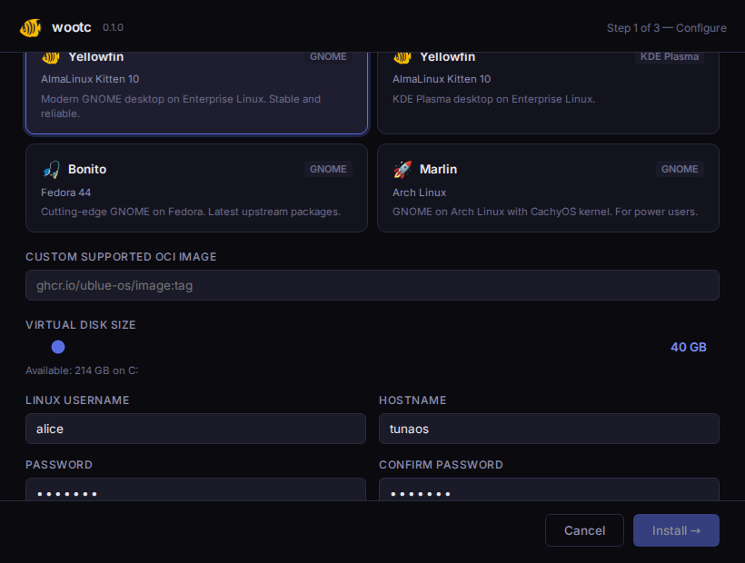
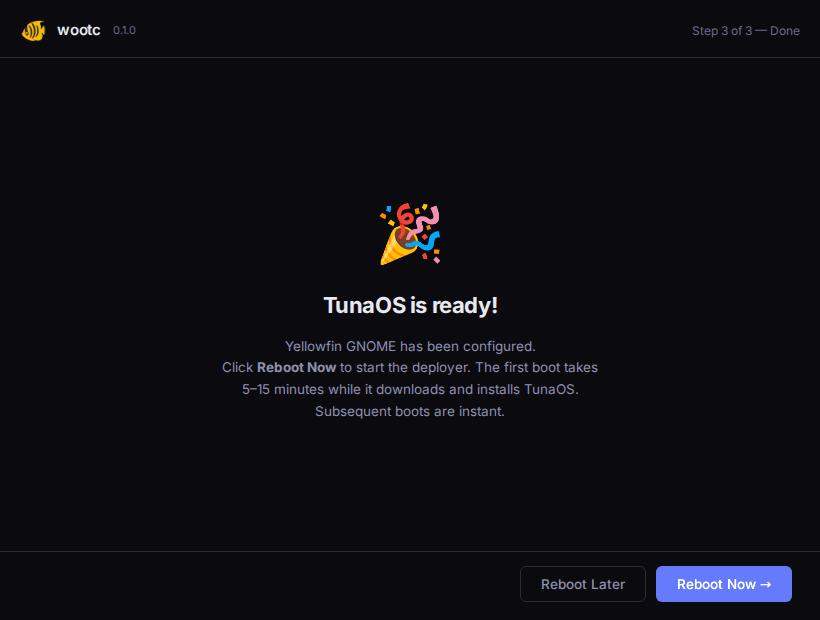
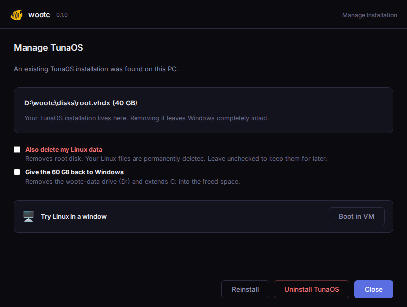
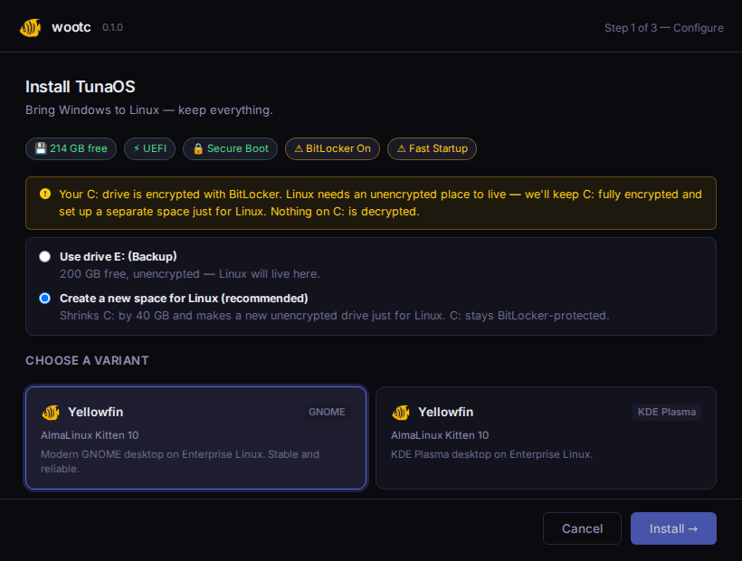
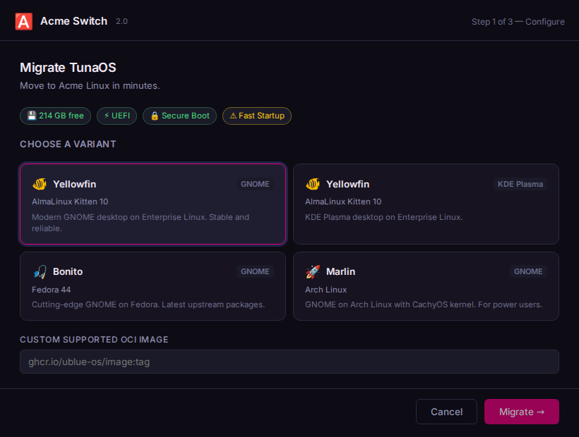
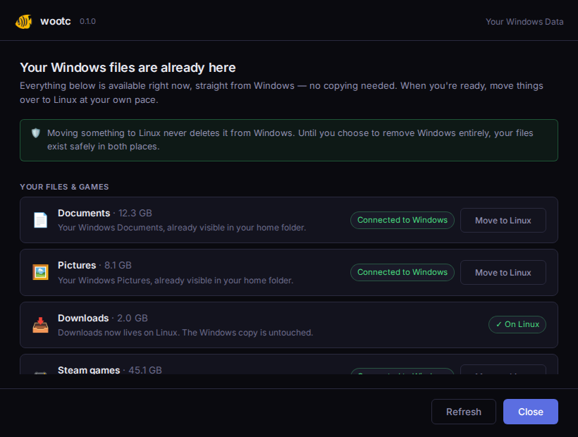
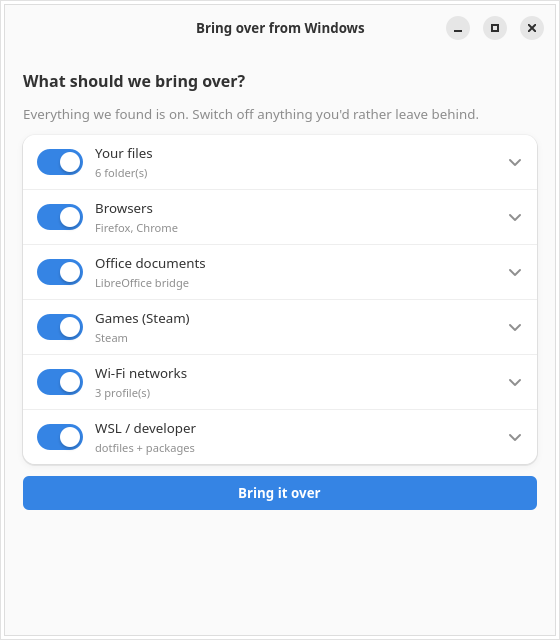
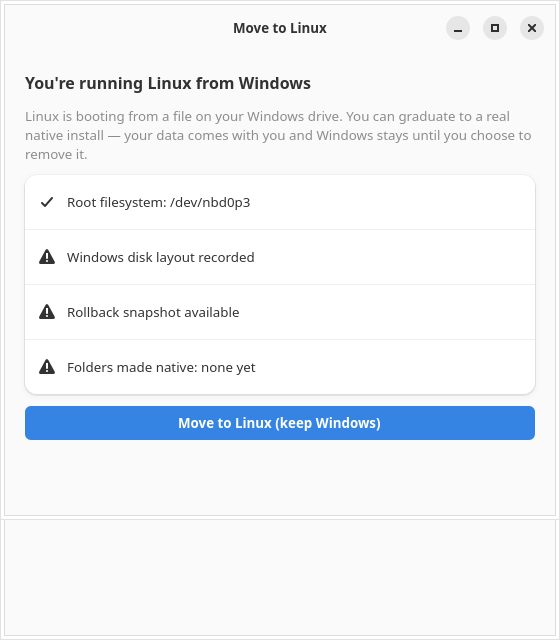
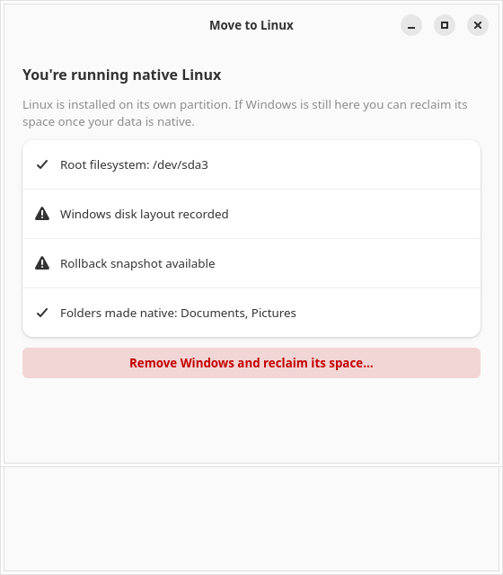
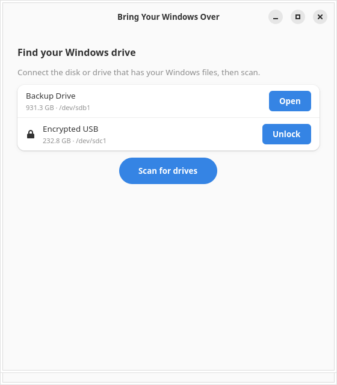

# GUI walkthrough

Screenshots are generated by the Playwright suite (`tests/gui/`), which
drives the real frontend bundle with a mocked backend — so this
walkthrough stays in sync with the shipping UI. Regenerate with
`cd tests/gui && npx playwright test`.

## 1. Launchpad — choose a variant


The first screen. System-info chips reflect the host (free space, UEFI,
Secure Boot, a Fast-Startup warning). The variant grid comes from the
catalog (`GetImages`, overridable via `C:\wootc\images.json`). Disk size,
username, hostname and password are collected here.

## 2. Validation gates the install



The Install button stays disabled with an inline reason until the form is
valid — variant chosen, a valid Linux username, and matching passwords.
No install can start half-configured.

## 3. Installing


A live progress bar plus a step checklist driven by `install:progress`
events from the backend pipeline (the same pipeline the headless mode and
E2E exercise).

## 4. Done



Reboot to start the deployer. First boot deploys TunaOS; subsequent boots
are instant.

## 5. Control panel — managing an existing install



When a `root.disk` already exists, the app opens here instead: reinstall,
uninstall (removes the boot entry, never the disk), or close.

## BitLocker — an unencrypted home for Linux (no forced decrypt)



When C: is BitLocker-encrypted, wootc never asks the user to decrypt.
Instead it offers to put Linux on an unencrypted volume — reuse an
existing one, or carve a new `wootc-data` partition from C: while C:
stays fully BitLocker-protected. `root.disk` + vault live on that
unencrypted volume so the installed system can mount them read-write
every boot without a decryption prompt (SPEC §3.5).

## 6. Branded re-skin



The same app re-skinned via `C:\wootc\brand.json` — partner name, logo,
accent color, and CTA verb ("Migrate"). See
[branding.md](branding.md).

## 7. Migration dashboard (installed Linux system)



On the installed system the app becomes the migration dashboard
(`GetMode` returns `migration` when the Windows volume is bridged at
`/host`). Files and games show their live state (Connected to Windows /
On Linux) with reversible one-click conversion; apps show honest per-app
outcomes (signed in / sign in once / re-link needed); the MS Office →
LibreOffice summary lists what transferred. Everything reiterates the
North Star promise: nothing is ever deleted from Windows.

---

# Linux-side apps

The screens above are the Windows installer (captured by the Playwright
suite). The apps below are the GTK4/libadwaita tools that run **on the
migrated Linux system**. Regenerate them with:

```bash
bash tests/gui/capture-linux-guis.sh
```

That renders each app headlessly in a container (Xvfb + GTK4's cairo
software renderer) against the same fixture hooks the unit tests use, so
these stay in sync with the shipping code.

## 8. Choose what to bring over



`wootc-manifest-gui`. It scans the mounted Windows volume and catalogs
everything migratable — files, browsers, Office documents, Steam, Wi-Fi,
WSL. **Everything discovered is on by default**; you switch off anything
you'd rather leave behind (an opt-out model, not a checklist you have to
fill in). Each row shows what was actually found — folder counts, which
browsers, how many Wi-Fi profiles. The choice is saved to
`~/.config/wootc/migration-selection.json` for the bridges to honor.

## 8b. Set up your account


`wootc-user-gui`. Your name, username, email and account picture are
carried over from Windows and already filled in — the screen asks for
exactly one thing you have to supply: a Linux password.

That is not an oversight, it is the one item wootc deliberately will not
migrate. Windows stores an NTLM hash and Linux a PAM/shadow crypt hash;
they are different algorithms, so there is nothing to copy. Copying
credential material would also breach the "never migrate secrets" rule
that keeps browser passwords and Wi-Fi enterprise credentials out of
scope. The screen says so plainly rather than leaving a blank field.

The password is handled as carefully as that framing implies: it is
never written to disk, never passed on a command line (where any process
could read it from `/proc`), and reaches `chpasswd` on stdin only. The
`~/.config/wootc/account.json` file it saves records the identity fields
and a `passwordSet` boolean — never the secret itself.

## 9. Move fully to Linux (Phase 3)



`wootc-go-native-gui`. While Linux is still running from `root.disk` on
the Windows volume, this offers to graduate onto a real disk. The safety
gates are surfaced directly in the UI — where root currently lives,
whether the Windows layout was recorded, whether a rollback snapshot
exists, and which folders are already native. Graduating keeps Windows
and `root.disk` in place, so it stays reversible.

## 10. Reclaim the Windows space



The same app once you're running natively. Reclaim is **only offered
after your data is native** — the identical hard gate the CLI enforces
(`wootc-go-native` refuses `--reclaim` otherwise). Before anything runs
you get the exact command plan to review; nothing destructive happens
without that explicit confirmation.

## 11. Bring your Windows over (another disk / BitLocker)



`wootc-import-gui`. For the case where Windows lives on a *different*
drive — a second internal disk, an external drive, or a backup. It finds
NTFS and BitLocker volumes (the running disk is never offered), unlocks
BitLocker read-only, and imports the same categories. Nothing on the
source drive is modified.
