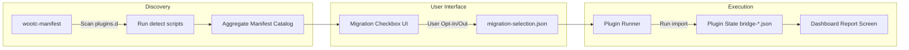

# Program Migrator Plugin Architecture (Design Document)

**Status:** Design Proposal / Architectural Seam  
**Issues:** [#203](https://github.com/tuna-os/wootc/issues/203), [#232](https://github.com/tuna-os/wootc/issues/232)  
**Milestone:** M4 (v0.9.0-rc: ship-shaped)  

---

## Current audit and next contract

The [migration extension plan](specs/migration-extensions.md) records the source audit
and the proposed version-2 contract. It identifies gaps in the discovery trust policy,
import results, transactions, and target verification. Existing manifests are a first seam,
not proof of a complete migration framework.

## 1. Executive Summary

wootc migrates user data, applications, and settings from Windows to a container-native Linux system. Today, migration logic is baked directly into bespoke shell scripts, Python scanners, and Go endpoints across three distinct execution phases (Windows Installer GUI, Deployer initramfs, and Target first-boot / dashboard runtime).

To make wootc extensible for community contributors and enterprise deployments (who need proprietary or customized migration paths for internal line-of-business software), migration integrations must decouple into modular **Program Migrator Plugins**.

This document defines the architectural contract for program migrator plugins:
1. **Plugin Unit**: Directory bundle with a declarative JSON manifest and lifecycle scripts (`detect`, `export`, `import`).
2. **Discovery & Staging**: Well-known directories on Windows and Linux targets with clear precedence.
3. **Trust & Execution Model**: Least-privilege phase separation, sanitization, sandboxing, and execution guardrails.
4. **UI & Dashboard Integration**: Dynamic discovery driving the manifest scanner, migration checklist, and status reports.
5. **Versioning & Compatibility**: Schema evolution and backward compatibility guarantees.
6. **1.0 vs Post-1.0 Scope Boundary**: Phased rollout ensuring stability for 1.0 without rushing unvetted third-party privilege escalation vectors.

---

## 2. Existing Migration Architecture (Baseline)

The current migration implementation spans multiple scripts under `payload/migration/` and endpoints in `app/`:

| Component | Language / Tool | Purpose | Current Limitation |
|---|---|---|---|
| `wootc-manifest` | Python 3 | Scans mounted Windows volume (`$WOOTC_HOST/Users/<user>`) and outputs discovery JSON | Hardcoded category list (`CATEGORIES`) |
| `wootc-manifest-gui` / `app/migration.go` | Go / Wails | Displays categories & checkboxes, emits `migration-selection.json` | Tightly coupled to built-in IDs |
| `wootc-detect-apps` | Bash / jq | Scans Windows `Program Files`, AppData, and registry stubs | Monolithic switch case for known apps |
| `wootc-steam-bridge` | Bash | Scans Steam library VDFs, maps NTFS paths to Linux paths | Standalone custom script |
| `wootc-office-bridge` | Bash / Python | Copies dictionaries, templates, fonts, configures LibreOffice | Standalone custom script |
| `wootc-import-browser` | Bash / Python | Imports bookmarks, history, profiles for Firefox/Chrome/Edge | Bespoke script invoked per user |
| `wootc-wifi-bridge` | Bash | Imports saved Wi-Fi profiles from staging | Ad-hoc systemd unit |

These components implicitly define a **detect → select → export → import** lifecycle, but lack formal boundaries, standard interfaces, error isolation, or extension points.

---

## 3. The Plugin Unit Specification

A Program Migrator Plugin is a self-contained bundle packaged as a directory (or tarball for distribution):

```text
<plugin-id>/
├── plugin.json               # Declarative manifest (required)
├── bin/
│   ├── detect                # Discovery script (required)
│   ├── export                # Windows / Stage 1 extraction script (optional)
│   └── import                # Linux / Stage 3 ingestion script (optional)
├── assets/
│   └── icon.svg              # 64x64 SVG icon for UI display (optional)
└── templates/                # Static configs, skeleton files, etc. (optional)
```

### 3.1 Plugin Identifier
- Unique lower-kebab-case identifier matching `^[a-z0-9][a-z0-9-]{2,62}[a-z0-9]$` (e.g., `steam`, `libreoffice`, `corp-vpn-bridge`).
- Reverse domain notation recommended for third-party / enterprise plugins (e.g., `com.acme.custom-erp`).

### 3.2 Manifest Schema (`plugin.json`)

```json
{
  "$schema": "https://tuna-os.github.io/wootc/schemas/v1/plugin.schema.json",
  "schemaVersion": 1,
  "id": "steam",
  "name": "Steam Game Libraries",
  "version": "1.2.0",
  "description": "Discovers installed Windows Steam libraries and mounts or links games into Linux Steam.",
  "category": "games",
  "author": "TunaOS Contributors",
  "license": "Apache-2.0",
  "homepage": "https://github.com/tuna-os/wootc",
  "target": {
    "appType": "native|flatpak|runtime-bridge",
    "suggestedPackages": ["com.valvesoftware.Steam"],
    "requiresHostMount": true
  },
  "execution": {
    "detectTimeoutSec": 10,
    "importTimeoutSec": 60,
    "requiresAdmin": false
  },
  "ui": {
    "defaultOn": true,
    "icon": "assets/icon.svg",
    "detailsTemplate": "{count} libraries detected ({sizeBytes})"
  }
}
```

### 3.3 Lifecycle Script Contracts

All lifecycle scripts communicate through standard POSIX exit codes, standard environment variables, and structured JSON stdout/stderr.

#### A. `detect` (Discovery Phase)
- **When & Where**: Executed during scan phase (`wootc-manifest scan`).
- **Environment**:
  - `WOOTC_HOST`: Path to mounted Windows root (e.g., `/run/wootc/host` or `C:\`).
  - `WOOTC_WIN_USER`: Target Windows username being inspected.
  - `WOOTC_WIN_USER_DIR`: Absolute path to `$WOOTC_HOST/Users/$WOOTC_WIN_USER`.
- **Output (stdout JSON)**:
  ```json
  {
    "detected": true,
    "items": [
      {
        "id": "main-library",
        "label": "Steam Library (C:\\Program Files (x86)\\Steam)",
        "detail": "12 games installed",
        "sizeBytes": 128849018880
      }
    ],
    "summary": "1 library, 12 games"
  }
  ```
- **Exit Codes**:
  - `0`: Success (valid JSON on stdout).
  - `1`: Non-fatal failure or unsupported target.
  - Other: Error logged, plugin treated as `detected: false`.

#### B. `export` (Windows Staging Phase)
- **When & Where**: Executed on the live Windows host if pre-flight staging or credential extraction (DPAPI) is required.
- **Environment**:
  - `WOOTC_STAGE_DIR`: Destination staging folder (e.g., `C:\wootc\install\stage\<plugin-id>\`).
  - `WOOTC_WIN_USER`: Current logged-in Windows user.
- **Output**: Writes artifacts into `$WOOTC_STAGE_DIR`.
- **Exit Codes**: `0` on success.

#### C. `import` (Target Linux First-Login Phase)
- **When & Where**: Executed on Linux during user session initialization or first boot (`wootc-apply-look` / dashboard post-install runner).
- **Environment**:
  - `WOOTC_HOST`: Path to mounted Windows volume (`/run/wootc/host`).
  - `WOOTC_STAGE_DIR`: Staged artifacts from export step (`/run/wootc/host/wootc/install/stage/<plugin-id>` or `/var/lib/wootc/stage/<plugin-id>`).
  - `WOOTC_LINUX_USER`: Current Linux username.
  - `WOOTC_LINUX_HOME`: Current user `$HOME`.
  - `WOOTC_STATE_DIR`: Plugin state output (`$HOME/.config/wootc/plugins/<plugin-id>`).
- **Output (JSON written to `$WOOTC_STATE_DIR/status.json`)**:
  ```json
  {
    "status": "success|partial|failed",
    "migrated": ["custom-dictionary", "templates", "fonts"],
    "note": "Office files now save in standard formats."
  }
  ```

---

## 4. Plugin Discovery and Precedence

Plugins can be loaded from multiple system and user locations. The scanner walks locations in descending order of precedence:

1. **Enterprise / Custom Stage Path**:
   - Windows: `C:\wootc\plugins.d\`
   - Linux: `/etc/wootc/plugins.d/`
2. **User Installed Plugins**:
   - Linux: `$HOME/.local/share/wootc/plugins.d/`
3. **First-Party Built-In Distribution Plugins**:
   - Linux: `/usr/lib/wootc/plugins.d/` or bundled in `payload/migration/plugins.d/`

If a plugin identifier is duplicated across layers, the higher precedence layer completely shadows the lower precedence layer (or overrides individual scripts if configured).

---

## 5. Trust and Security Model

Program migrators execute code that inspects Windows file systems and configures target Linux user environments. This presents a critical security surface.

### 5.1 Security Principles
1. **No Arbitrary Code Execution as Root**: Plugin `import` scripts must run with the privileges of the target Linux user (`$WOOTC_LINUX_USER`), *never* as root. If system-level changes are required (such as installing a system font or udev rule), they must be gated behind polkit actions or pre-vetted system helpers (`org.tunaos.wootc.policy`).
2. **Deterministic Timeouts & Process Limits**:
   - `detect` scripts must terminate within 10 seconds.
   - `import` scripts must terminate within 60 seconds (or report streaming progress).
   - Execution occurs under `systemd-run --user --scope` with resource slice limits when available.
3. **No Unsandboxed Network Access**: Discovery and local migration scripts must operate completely offline against local storage. Network fetches (e.g., flatpak installs) are coordinated exclusively by the wootc supervisor.
4. **Credential Isolation**: Any session credential migrations (e.g., Chromium cookie vaults or DPAPI tokens) must go through the core vault subsystem and explicit per-app UI consent gates. Plugins are not granted unconstrained access to `vault.json`.

### 5.2 Verification and Signing (Post-1.0)
- **First-Party Plugins**: Shipped in the read-only composefs/ostree image under `/usr/lib/wootc/plugins.d/`, protected by system image immutability.
- **Third-Party / Enterprise Plugins**: Must carry a cryptographic signature (`plugin.json.sig`) validated against keys in `/etc/wootc/trusted-keys.d/` before execution is permitted, unless explicitly bypassed via enterprise policy flag (`AllowUnsignedPlugins=true`).

---

## 6. UI & Dashboard Integration

The migration dashboard dynamically renders plugin entries without recompilation:



1. **Manifest Scan (`wootc-manifest`)**: Iterates through active plugins, invokes `./bin/detect`, and aggregates the returned JSON into category sections in `catalog.json`.
2. **Selection Checklist**: The frontend UI groups plugins by `category` (e.g., `files`, `browsers`, `office`, `games`, `custom`). The user can toggle individual plugins or items.
3. **Reporting**: After execution, the dashboard reads `$HOME/.config/wootc/plugins/<id>/status.json` and renders a clean, human-readable summary.

---

## 7. Versioning & Backward Compatibility

- Manifest schema uses semantic versioning (`schemaVersion: 1`).
- Future additions to `plugin.json` must be additive and backward-compatible.
- Plugins declare minimum wootc API compatibility:
  ```json
  "compatibility": {
    "minWootcVersion": "0.9.0",
    "maxSchemaVersion": 1
  }
  ```
- If an unsupported schema version is encountered, wootc gracefully skips the plugin and logs a diagnostic warning rather than failing the migration run.

---

## 8. 1.0 vs Post-1.0 Scope Boundary

To maintain high confidence for the **v1.0.0** stable release while enabling future extensibility:

### Scope for 1.0 (Milestone M4 / v0.9.0-rc)
- **Internal Interface Refactor Only**:
  - Restructure first-party migration tools (`wootc-detect-apps`, `wootc-steam-bridge`, `wootc-office-bridge`, `wootc-import-browser`, `wootc-wifi-bridge`) into the internal plugin directory structure and manifest format.
  - Implement plugin discovery in `wootc-manifest` to dynamically discover `/usr/lib/wootc/plugins.d/`.
  - Maintain 100% backward compatibility for all existing tests and dashboard contracts (`tests/migration/test-bridge.sh`).
- **No Third-Party Plugin Loading**:
  - Do not load arbitrary executable code from external/unvetted directories on Windows or Linux during 1.0.
  - Keep plugin discovery restricted to built-in system paths.

### Scope for Post-1.0 (Future Milestones)
- **Third-Party / Enterprise Drop-In Directory**:
  - Support `C:\wootc\plugins.d\` and `/etc/wootc/plugins.d/`.
- **Plugin Signature Verification**:
  - Full cryptographic signing and GPG/Authenticode verification for third-party plugin packages.
- **Plugin Store / Community Repository**:
  - Centralized catalog of community contributed migration recipes.
- **Enterprise Management Policy**:
  - Group Policy / Registry keys to pre-configure and enforce enterprise migration plugins.

---

## 9. Next Steps and Tracking

Following the merge of this architectural decision:
- Track follow-up implementation under **#203 (Program Migrator plugins)**.
- Stage the directory refactoring in `payload/migration/plugins.d/` as part of M4 polish.
- Add unit tests verifying plugin manifest parsing and timeout enforcement in `tests/migration/`.
