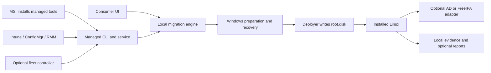

# Enterprise migration — proposal

Status: design proposal, 2026-09-26. The interfaces below do not yet exist.
See the [status matrix](../status.md#buildtest-matrix) for current support.
This spec does not change that support or the release gates.

## 1. Product priority

**Home users come first, even on older hardware.**

They should reach Linux, find their files, and return to Windows without an IT team.
Enterprise work must improve that path or remain separate from it.

| Priority | Outcome | Constraint |
|---|---|---|
| P0: home user | One download, clear checks, a useful desktop, files intact, an obvious way back | No tenant, domain, account with wootc, server, or fleet agent needed |
| P1: shared foundation | Resume downloads, recover from power loss, verify artifacts, explain failures | Same engine and safety checks for every UI |
| P2: managed pilot | IT can assess and stage a small group with explicit policy | Starts after the P0 gates pass |
| P3: fleet | Staged rollout, identity, reports, support delegation | Separate adapters; no extra consumer screens |

### Older hardware

Assess the actual machine before any boot change. Do not equate age with support.

| Area | Proposed rule |
|---|---|
| Hardware cohort | Test older x86-64 UEFI laptops and desktops, SATA SSDs, HDDs, and low-memory systems |
| Resource targets | Measure a 4 GiB RAM cohort and an 8 GiB cohort; treat these as test targets, not minimum-support claims |
| CPU and graphics | Check image CPU requirements, GPU drivers, display, suspend/resume, and external monitors |
| Firmware | Keep Secure Boot checks; explain an unsupported firmware or trust chain in plain language |
| No TPM | Offer only a mode the matrix has proved. Never imply TPM-backed protection on a machine without a TPM |
| Legacy BIOS/32-bit | Out of initial scope; stop before mutation and explain why |
| Storage | Measure free space, ESP capacity, disk health, image expansion, and a protected Windows reserve |
| Network | Resume downloads on Windows and verify an offline payload before the reboot |
| User data | Detect cloud placeholders, EFS, other users, and encrypted volumes; never silently skip inaccessible data |
| Usability | Large text, keyboard access, screen readers, useful progress, and a local support bundle |

The consumer release gate includes Wi-Fi, audio, sleep, file access, and Windows return on real older hardware.
No enterprise feature can waive that gate.

## 2. Scope and architecture

Use one local engine behind the consumer UI, a managed CLI, and an optional service.
Keep the [provisioner boundary](../architecture-boundary.md) intact.
The controller chooses policy; the endpoint enforces it.



| Component | Responsibility | Boundary |
|---|---|---|
| Core engine | Preflight, plan, stage, arm, boot proof, repair, uninstall | No fleet vendor SDKs or directory passwords |
| Managed CLI | Versioned JSON API, operation IDs, local status | Uses the same policy checks as the UI |
| Windows service | Long jobs, resume after restart, SYSTEM execution | Explicit SID map; SYSTEM is never the migrated person |
| MSI | Install/update/remove the management tools | No OS deployment inside a long MSI custom action |
| Linux agent | First-boot proof, health, optional identity enrollment | Optional for consumers; no permanent remote shell |
| Fleet controller | Signed plans, rollout limits, device evidence | Optional; existing endpoint tools can drive the CLI |
| Image profile | Pinned OCI digest, packages, CA trust, identity adapter | Changes only after image and boot-chain proof |

Do not build a new MDM or directory server in the first release.
Reuse existing tools through documented adapters.

## 3. Fleet journey and gates

| Step | Action | Evidence before the next step |
|---|---|---|
| Inventory | Read firmware, storage, encryption, apps, profiles, and network needs | Report has no writes or reboot |
| Assess | Classify each device as eligible, blocked, or review-needed | Exact reasons and evidence version; no guessed green |
| Plan | Pin the image, policy, identities, recovery path, and time window | Signed plan, unique device and operation IDs, expiry |
| Stage | Fetch and verify payloads; reserve space | Complete verified bytes and current free-space proof |
| Arm | Recheck all gates and set one-shot boot | Durable boot journal and Windows recovery entry |
| Deploy | Install into root.disk | Deployer result only; this is not desktop success |
| First boot | Observe the installed system | Boot ID, image digest, operation nonce, services, and file proof |
| Identity | Enroll if the plan asks for it | Identity lookup, allowed/denied access tests, and host key proof |
| Acceptance | User or pilot owner confirms required apps and files | Desktop session, representative work, Windows return |
| Complete | Close the operation with all required evidence | No stale marker, unreachable device, or timeout can mean success |
| Graduate | Optional later move to native Linux storage | Separate destructive plan, backup proof, approval, and native-boot proof |

Suggested rollout rings are lab, IT volunteers, a small hardware-diverse pilot,
then site cohorts. These are proposal defaults, not evidence of readiness.

| Control | Proposed default |
|---|---|
| Automatic promotion | Off until the pilot owner accepts the evidence |
| Concurrency | Small per-site limit; cap downloads and active migrations separately |
| Stop conditions | Any data-loss report, failed recovery, bad signature, or unexplained boot failure pauses new arms |
| Transient failures | Retry a bounded number of times with backoff; report the cause |
| Deadline | A plan expires before new boot changes; never interrupt a disk write just because the window ended |
| Pause | Stop new arms; let an active install reach a safe checkpoint |
| Offline endpoint | Report unknown/stale; do not infer success or failure from silence |
| Operator roles | Viewer, planner, approver, operator; destructive approval separate from plan authorship |

## 4. MSI and command contract

This section proposes `WOOTC_*` properties and `wootcctl` commands.
The package installs tools first. A separate command starts a migration.

```powershell
# Proposed package. C:\Logs must already exist.
msiexec.exe /i wootc-managed.msi /qn /norestart /L*v C:\Logs\wootc-msi.log WOOTC_MODE=managed WOOTC_POLICY_FILE=C:\ProgramData\Org\wootc-policy.json

wootcctl.exe assess --output json
wootcctl.exe plan --policy C:\ProgramData\Org\wootc-policy.json --output json
wootcctl.exe stage --plan-id pilot-2026-001 --output json
wootcctl.exe arm --plan-id pilot-2026-001 --output json
wootcctl.exe status --operation-id DEVICE-OP-ID --output json
wootcctl.exe repair --operation-id DEVICE-OP-ID --output json
```

Microsoft defines `/qn`, `/norestart`, and MSI log options.
The log directory must exist. See [msiexec](https://learn.microsoft.com/windows-server/administration/windows-commands/msiexec).

| Property | Accepted values | Rule |
|---|---|---|
| `WOOTC_MODE` | `consumer`, `managed` | Managed mode never starts an OS migration on its own |
| `WOOTC_POLICY_FILE` | Absolute local path | Schema and signature checks before use; copy into a protected store |
| `WOOTC_CONTROLLER_URL` | HTTPS URL | Must match the trusted organization policy |
| `WOOTC_DEVICE_ID` | Opaque organization ID | Bind to local enrollment; never use a display hostname as sole identity |
| `WOOTC_CACHE_GB` | Bounded integer | Cannot reduce the Windows reserve or override low-space checks |
| `WOOTC_REBOOT_POLICY` | `defer`, `window` | Default `defer`; a verified plan supplies the window |
| `WOOTC_LOG_LEVEL` | `normal`, `diagnostic` | Both redact secrets; diagnostic access has an expiry |

Reject unknown properties that could alter a migration. Do not accept passwords,
join tokens, arbitrary shell commands, or disk-wipe flags in MSI properties.
The plan fixes the image digest, identity rules, and disk choices.
The CLI cannot weaken it.

| Interface | Result contract |
|---|---|
| MSI `0` | Management package is installed, not Linux |
| MSI `3010` | Package needs a restart; orchestration must still honor the reboot policy |
| CLI `0` | Requested operation completed or was durably accepted; JSON distinguishes these cases |
| Proposed CLI `10` / `20` / `30` | Policy block / retryable failure / terminal failure |
| JSON | `schemaVersion`, `operationId`, `planDigest`, `state`, `reasonCode`, `retryable`, `nextAction`, `evidence` |
| Idempotency | Same device and plan digest resumes one operation; concurrent plans cannot own the same disk |
| Cancellation | Reports accepted-at-checkpoint or denied-during-commit; never kills a disk writer |

Use separate detection rules for the MSI and for migration completion.
Microsoft Intune supports custom detection scripts and return-code rules.
See [Win32 app deployment](https://learn.microsoft.com/en-us/mem/intune/apps/apps-win32-add).

MSI repair must not re-arm a boot. MSI removal must not erase user data or Linux.
Use a separate plan to restore Windows and retain Linux-only files.

## 5. Signed policy example

This is an illustrative payload, not a current configuration file.
A detached signature covers its canonical bytes. The digest below is a placeholder.

```json
{
  "schemaVersion": 1,
  "planId": "pilot-2026-001",
  "deviceId": "asset-0042",
  "expiresAt": "2026-10-15T18:00:00Z",
  "image": "registry.example.com/desktop@sha256:<64-hex-digest>",
  "release": "<approved-wootc-release>",
  "mode": "retain-windows",
  "reboot": {"policy": "window", "windowId": "site-a-evening"},
  "identity": {
    "provider": "ad",
    "domain": "ad.example.com",
    "computerName": "ASSET0042-LNX",
    "computerOU": "OU=LinuxPilot,DC=ad,DC=example,DC=com",
    "idMapping": "sssd-sid",
    "allowedGroups": ["Linux-Pilot"],
    "offlineLogin": {"enabled": false}
  },
  "profiles": [{"windowsSID": "<user-SID>", "principal": "alice@ad.example.com"}],
  "data": {"keepWindows": true, "cloudFiles": "require-hydration"},
  "enrollment": {"broker": "https://enroll.example.com", "credentialRef": "device-bound"},
  "reporting": {"endpoint": "https://fleet.example.com", "retentionDays": 30}
}
```

| Trust property | Requirement |
|---|---|
| Organization bootstrap | Admin-approved enrollment anchors the policy key; a downloaded file cannot trust its own key |
| Artifact trust | Verify release signatures and OCI digests independently of the mirror; pin all boot artifacts |
| Replay | Bind plan, nonce, device, expiry, and monotonic sequence; reject stale operations after snapshot restore |
| Delegation | Separate content approval, fleet approval, and enrollment rights |
| Local privilege | Protect state trees and reject attacker-owned paths, unsafe ACLs, and reparse points |
| Transport | TLS validation, authenticated reports, bounded retries; no ambient untrusted mirror override |
| Secret handoff | One-use device enrollment, short validity, minimal privilege; no domain-admin password in the image |

On suitable hardware, use a hardware-backed device key for enrollment.
Without it, the organization must select and test another secure bootstrap method.
Never copy a Windows DPAPI blob to Linux and assume Linux can decrypt it.
Do not place keytabs, recovery keys, passwords, or join secrets on shared NTFS.

## 6. Identity options

`realmd` helps discover and configure a domain join. SSSD provides identity,
authentication, and access for Linux. These are distinct roles.
[Direct AD integration from Red Hat](https://docs.redhat.com/en/documentation/red_hat_enterprise_linux/8/html/integrating_rhel_systems_directly_with_windows_active_directory/connecting-rhel-systems-directly-to-ad-using-sssd_integrating-rhel-systems-directly-with-active-directory).

| Mode | Proposed adapter | Best fit | Important boundary |
|---|---|---|---|
| Local | Local Linux account | Home user; no enterprise infrastructure | Default consumer path |
| Direct AD | `realmd` + `adcli` + SSSD AD provider | Keep the current AD identity source | Separate Linux computer account and hostname |
| FreeIPA | `ipa-client-install` + SSSD IPA provider | Linux-managed identity, host access, sudo, certificates | Needs an existing IPA service and tested image support |
| FreeIPA with AD trust | IPA client plus an existing forest trust | AD users access Linux hosts under IPA policy | Administrators establish the trust separately |
| Cloud-only Entra ID | Future adapter or explicit re-auth/local account | Devices without AD DS | Not equivalent to AD; `realm join` is not an Entra join |

A FreeIPA trust can give AD users access to resources under IPA control.
The trust direction and topology matter. wootc must not create a forest trust.
See [FreeIPA trust setup](https://www.freeipa.org/page/Active_Directory_trust_setup).

### AD adapter

| Stage | Required behavior |
|---|---|
| Image | Ship compatible `realmd`, `adcli`, SSSD, Kerberos, and home-directory support in the immutable image |
| Network | Check DNS SRV records, time, DC reachability, VPN, CA trust, and site routing |
| Computer identity | Create a distinct Linux object; never rotate or reuse the Windows object's machine password |
| Join rights | Delegate only creation/reset in the approved OU; no Domain Admin credential on endpoints |
| Join transaction | Journal the computer object and keytab result; retry without duplicate objects |
| Login policy | Explicit group allowlist and denial tests; test the SSSD-supported GPO subset, not a claim of full Windows GPO support |
| Offline login | Opt-in cache policy with a bounded lifetime; prove one online login first |
| Failure | Show a repair path or return to Windows; never mark a failed join as managed-ready |
| Removal | Revoke the Linux host identity only; preserve the Windows domain relationship |

### FreeIPA adapter

| Stage | Required behavior |
|---|---|
| Preflight | Discover IPA DNS, CA, time, replica availability, and the chosen hostname |
| Enrollment | Use a short-lived host-specific credential through a protected API or stdin path |
| Secret handling | Do not pass a secret as a logged command argument, even if the tool offers that option |
| Policy | Validate HBAC, sudo, home creation, and certificate renewal separately |
| AD trust | Test both permitted and denied AD users through the actual trust path |
| Cleanup | Revoke one host enrollment on failure; do not change realm-wide trust or access rules |

### People and their files

SSSD can derive POSIX IDs from AD SIDs or use directory POSIX attributes.
Choose one method per domain and preserve it. See the [SSSD AD provider](https://sssd.io/docs/ad/ad-provider.html).

| Risk | Required behavior |
|---|---|
| Name collision | Map Windows SID to domain-qualified principal and stable UID/GID; never rely on name alone |
| UAC/SYSTEM | Resolve the intended person from the plan and Windows profile inventory, not the elevated process |
| Shared device | Explicit multi-user map; separate homes and per-user access checks |
| Non-Latin names | Preserve source identity; store display names separately from filesystem-safe identifiers |
| NTFS bridge | Do not assume one mount UID enforces multiple users' Windows ACLs; block that mode until isolation is proved |
| File copy | Create a manifest, verify bytes and ownership, record skips, preserve the source until acceptance |
| EFS and cloud placeholders | Hydrate/decrypt through an authorized Windows path before transfer, or block with a clear reason |
| Tokens and apps | No promise of DPAPI, SSO, browser, VPN, Office, or certificate portability; use explicit re-auth where needed |
| Cached credentials | No offline-first-login promise; cache policy and revocation limits must be explicit |

An identity lookup alone does not prove a desktop login.
Test PAM access, the graphical session, home ownership, and denied access.
SSSD's cache is policy-dependent; see its [introduction](https://sssd.io/docs/introduction.html).

## 7. Recovery and operator evidence

| Failure | Local behavior | Fleet evidence |
|---|---|---|
| Power loss during stage | Resume verified chunks; discard incomplete ones | Checkpoint and remaining bytes |
| Power loss during boot changes | Replay or undo the journal | Exact boot entries and recovery result |
| Linux fails to boot | Preserve a tested Windows return path | Boot attempt ID, serial trace, timeout reason |
| DC/VPN unavailable | Hold identity enrollment; retain Windows access | Separate boot-ready from identity-ready |
| User cannot work | Offer Windows return and support export | Failed app/file checks; no automatic disk purge |
| Bad rollout | Stop new arms; quarantine the release | Affected devices and signed replacement plan |
| Native graduation fails | Use the separately tested recovery procedure | Backup restore proof; never call root.disk a backup |

Preserve BitLocker protection and the organization's recovery-key escrow.
A managed install must not weaken encryption to bypass a failed preflight.
Disk rollback does not restore newer files; reconcile those files before removal.

| Evidence | Content |
|---|---|
| Local status | Durable operation state, phase, reason, next action, and last verified checkpoint |
| First boot | Operation nonce, installed image digest, boot ID, service health, and test-file proof |
| Identity | Provider, host enrollment result, allow/deny outcomes; no password or keytab |
| Support bundle | Redacted logs, hardware summary, state timeline; user preview for consumer export |
| Fleet report | Device pseudonym, plan digest, timestamps, evidence schema, authenticated sender |
| Privacy | No file contents, recovery keys, browser tokens, or full usernames by default |
| Retention | Organization policy with deletion support; no consumer reporting without consent |

## 8. Test and delivery plan

Use Corral with the KubeVirt backend for repeatable stage inspection.
Use snapshots to reproduce failures. Also test on hardware.
Use an isolated directory lab, not a production AD or IPA domain.

| Test lane | Required proof |
|---|---|
| Consumer regression | Same simple UI, offline payload, file bridge, repair, and Windows return |
| Older hardware | RAM/CPU cohorts, HDD/SSD, Wi-Fi, graphics, suspend, battery/power loss, small ESP |
| Corral/KubeVirt | Snapshots before arm, deploy, first boot, join, acceptance, and optional graduation |
| Direct AD | Fresh and reused host names, OU denial, DNS/time faults, online login, offline-cache expiry |
| FreeIPA | Enrollment expiry, replica failure, HBAC deny, certificate renewal, and trusted AD user |
| Data isolation | Two users, identical short names in different domains, non-Latin names, denied cross-user reads |
| Management | SYSTEM with no desktop session, duplicate dispatch, expired plan, interrupted MSI upgrade |
| Recovery | Power loss at each commit boundary, bad image, bad key, Windows return, Linux-only file export |
| Scale | Simulated controller load, bounded site downloads, staged cohort rollout, stale-report detection |
| Security | Tampered policy, hostile mirror, unsafe state tree, replayed report, stolen/expired enrollment token |

| Delivery increment | Exit gate |
|---|---|
| E0: consumer foundation | Repeatable GUI E2E plus older-hardware reports; no new enterprise UI |
| E1: local managed contract | Read-only assessment, signed plan, idempotent CLI, reliable state and repair |
| E2: package and adapters | MSI lifecycle, Intune/ConfigMgr/RMM recipes, no implicit reboot or migration |
| E3: AD pilot | One supported immutable image, isolated AD lab, file isolation, Windows domain return |
| E4: IPA pilot | IPA client and optional existing AD trust; equivalent access and recovery proof |
| E5: fleet control | Rings, delegated approval, authenticated reports, pause and quarantine |
| E6: native retirement | Separate backup, data reconciliation, destructive approval, and restore exercise |

Track each increment with an issue and observable exit criteria before implementation.
Do not label this proposal enterprise-ready or change a matrix cell because the document exists.

## 9. Decisions left to a pilot

| Decision | Owner | Default until decided |
|---|---|---|
| First organization and image | Maintainer and pilot IT | No enterprise support claim |
| Direct AD or IPA trust | Directory administrator | Direct AD pilot first; local accounts for consumers |
| Allowed apps and data | Pilot owner and users | Explicit inventory and re-auth; no silent token transplant |
| UID strategy and multi-user storage | Directory and security teams | Stable IDs; block unproved shared NTFS access |
| Enrollment broker and device proof | Security team | No fleet-wide shared join secret |
| Offline-login duration | Security and endpoint teams | Disabled until policy and tests exist |
| Native retirement date | Device owner and IT | Keep Windows; no automatic graduation |
| Support and retention | Maintainer and pilot IT | Local logs; minimal optional reports |
