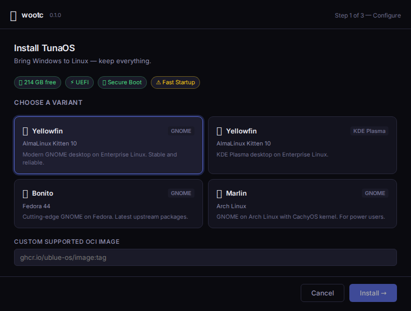
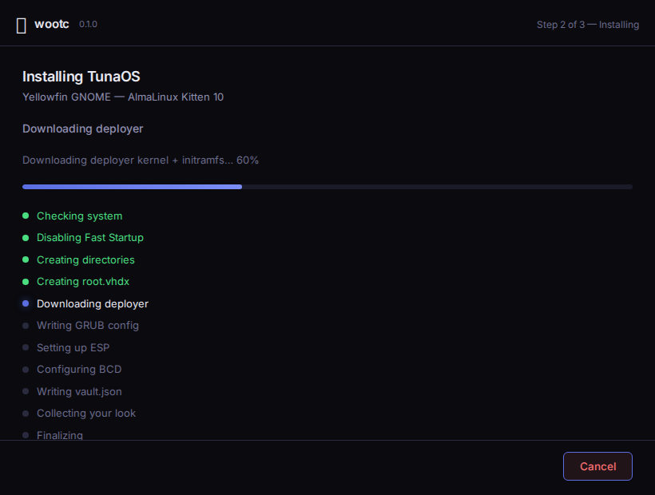

# wootc User Guide

**Switch from Windows to Linux without losing your data — and change your mind
any time until you're sure.**

wootc installs a real, modern Linux desktop *from inside Windows*. There's no
repartitioning of your Windows drive, no USB stick to make, and no point of no
return until **you** decide there is one. Your Linux system lives in a single
file next to Windows; both boot from the same disk. If anything goes wrong, your
next reboot is still Windows.

> This guide is written for people who have never touched a partition editor.
> If a step ever feels scary, that's a bug in our wording — nothing wootc does
> is permanent until the very last, clearly-labelled step.

---

## Contents

1. [Is my PC ready?](#1-is-my-pc-ready)
2. [Install Linux (Phase 1)](#2-install-linux-phase-1)
3. [First boot into Linux (Phase 2)](#3-first-boot-into-linux-phase-2)
4. [Bring your stuff over](#4-bring-your-stuff-over)
5. [Try it first, commit later](#5-try-it-first-commit-later)
6. [Import from another disk or a backup](#6-import-from-another-disk-or-a-backup)
7. [Encryption & BitLocker](#7-encryption--bitlocker)
8. [Go Linux-only (Phase 3)](#8-go-linux-only-phase-3)
9. [Uninstall — put everything back](#9-uninstall--put-everything-back)
10. [Troubleshooting](#10-troubleshooting)

---

## 1. Is my PC ready?

wootc runs a quick check when it starts and tells you in plain language if
anything needs attention. Under the hood it wants:

- **Windows 10 or 11**, 64-bit, UEFI (nearly all PCs since ~2015).
- **~40 GB of free space** for a comfortable Linux install (you choose the size).
- **Secure Boot** on is fine — wootc uses a Microsoft-trusted boot chain.
- **BitLocker** is fine too — wootc never asks you to decrypt your drive
  (see [§7](#7-encryption--bitlocker)).

You don't need to disable Secure Boot, make a bootable USB, or shrink partitions
yourself. wootc handles all of it.

---

## 2. Install Linux (Phase 1)

Download and run **wootc.exe**. You'll see the Launchpad:

1. **Pick a desktop.** Choose from the catalog — GNOME, KDE Plasma, Niri, or
   XFCE, on an Enterprise Linux, Fedora, Arch, or Debian base. Not sure? The
   default (Yellowfin GNOME) is a great, stable starting point.
2. **Name your setup.** Username, password, hostname, and how much disk to give
   Linux. The preflight shows your free space live.
3. **Choose encryption** (optional): TPM auto-unlock (recommended), a passphrase,
   or none — see [§7](#7-encryption--bitlocker).
4. **Optionally tick "Make it feel like Windows"** to bring your wallpaper,
   accent color, keyboard layout, taskbar pins, and desktop shortcuts across on
   first login. Off by default, so the desktop keeps its own look. Supported on
   the Wayland desktops (GNOME, KDE Plasma, niri); other settings still migrate.
5. Click **Install**. wootc creates your Linux disk file, stages a signed boot
   entry, and arms a **one-time** boot into the installer. **Nothing else on
   your PC changes.**

When it finishes, reboot when you're ready. That's the *only* moment Linux takes
over — and it's a one-shot: if the install were to fail, your PC boots straight
back to Windows.

---

## 3. First boot into Linux (Phase 2)

On the next reboot, wootc's deployer runs once — it unpacks your chosen Linux
image onto your disk file and reboots into your new desktop. This first run
takes a few minutes; after that, Linux boots like any normal OS.

Your Linux system boots directly from the disk file on your Windows drive. The
OS itself is a standard, image-based (bootc) system that updates itself
atomically — the same image whether it lives in a file today or on its own
partition later.

**Windows is still there.** You can boot back into it any time from your PC's
boot menu; wootc doesn't remove it (until you ask it to — [§8](#8-go-linux-only-phase-3)).

---

## 4. Bring your stuff over

Open the **Bring your setup over** dashboard. wootc migrates honestly — it moves
what it safely can and clearly says what needs a fresh sign-in. It follows three
consent tiers:

| Tier | What happens | Examples |
|---|---|---|
| **Applied automatically** | Non-secret preferences with an obvious Linux equal | wallpaper, accent, keyboard layout, timezone, hostname |
| **Offered with preview** | Useful data you can inspect first | files, browser data, Steam libraries, Wi-Fi, apps |
| **Never copied silently** | Secrets & identity material | passwords, private keys, tokens, enterprise Wi-Fi creds |

What it brings over:

- **Files** — Documents, Desktop, Pictures, Downloads, Music, Videos.
- **Browsers** — Firefox moves *everything* (bookmarks, history, logins, open
  tabs). Chrome/Edge move bookmarks and history; sign in once and sync restores
  the rest.
- **Steam** — your installed games are reused in place; no re-download.
- **MS Office → LibreOffice** — styles, custom dictionary, and settings.
- **Apps** — detects your Windows apps and installs the Linux equivalents.
- **WSL** — copies your WSL dotfiles (public keys only) and turns your installed
  packages into a Homebrew `Brewfile` (`brew bundle` rebuilds your toolchain).
- **Wi-Fi** — your saved networks become NetworkManager connections so you're
  online on first boot. Enterprise/802.1X networks are detected but need a fresh
  sign-in.
- **Windows-Style Mode** (if you ticked it) — wallpaper, accent, keyboard, and
  your taskbar/desktop shortcuts.

**Secrets stay put.** wootc never silently copies passwords, private SSH/GPG
keys, tokens, or credential stores — you sign in again where it matters.

---

## 5. Try it first, commit later

Not ready to reboot? Two ways to preview:

- **Boot in VM** — run your installed Linux in a window *without* rebooting,
  right from Windows. It's the same disk, so any changes you make persist.
- **Try in VM (fresh)** — build a preview of an image and try it in a window; if
  you like it, **Install for Real** promotes the very same disk to your
  permanent install (no re-download, no re-deploy).

Either way, you're always one reboot away from Windows.

---

## 6. Import from another disk or a backup

Already on Linux and want to pull data from a Windows install on a **different**
drive — a second internal disk, an external/USB drive, or a backup? Open
**Bring Your Windows Over** on the Linux side:

1. **Scan** — wootc lists the Windows drives it finds.
2. **Unlock** — BitLocker-encrypted drives are unlocked **read-only** with your
   password or 48-digit recovery key. The source drive is never modified or
   decrypted in place.
3. **Pick the user** whose files to bring over.
4. **Choose what to import** — the same categories as the dashboard above.

---

## 7. Encryption & BitLocker

**Your Windows BitLocker is safe.** wootc never forces you to decrypt your
Windows drive. If C: is BitLocker-protected, wootc offers to put Linux on an
unencrypted partition (creating one by safely shrinking, or reusing an existing
one) — **C: stays encrypted the whole time.**

**Encrypting Linux** is a separate choice for your Linux disk:

- **TPM auto-unlock** (recommended) — LUKS encryption that unlocks automatically
  via your PC's TPM chip. No prompt at boot.
- **Passphrase** — asks for a password every boot.
- **None** — fastest; anyone with the PC can read the Linux disk.

---

## 8. Go Linux-only (Phase 3)

When you're confident, you can graduate Linux onto its own native partition and
reclaim the space Windows was using. This is the one genuinely irreversible
step, and wootc treats it that way:

- **Stage 5 — Graduate to native (reversible).** wootc puts a real Linux
  partition on your disk and moves your system onto it. Windows and your
  original setup stay put until you take the final step, so you can still roll
  back.
- **Stage 6 — Remove Windows (irreversible).** Only offered once **everything
  you use is already on Linux**. This deletes the Windows partition and grows
  Linux to fill the disk.

wootc refuses stage 6 until your data is verified native and a rollback snapshot
exists — you can't accidentally delete something that hadn't moved yet.

> Prefer to keep both? Just don't take stage 6. Dual-boot Windows + Linux is a
> perfectly good place to stop.

---

## 9. Uninstall — put everything back

Changed your mind? wootc is fully reversible up until Phase 3 stage 6. The
uninstaller:

- Removes the wootc boot entry from Windows.
- Deletes `C:\wootc\` (including your Linux disk file).
- Removes the Linux bootloader from the ESP.
- If Linux was on a dedicated partition, reclaims it and gives the space back to
  Windows.

Your Windows install is left exactly as it was.

---

## 10. Troubleshooting

- **"Boot Windows once and shut down fully."** Windows Fast Startup or
  hibernation left the drive in a locked state. Boot Windows, choose
  *Shut down* (not restart), and try again.
- **Stuck on the boot menu.** Pick "Windows Boot Manager" to get back to
  Windows; nothing is lost.
- **A migration says "sign in again."** That's by design — wootc never copies
  passwords or tokens. Sign in once and cloud sync brings the rest.
- **My PC has no TPM / old firmware.** Choose GRUB2 + passphrase (or no)
  encryption in Advanced options.

---

*wootc is early, actively-developed software. The full
Windows → deployer → native Linux → back-to-Windows loop is verified
end-to-end on real hardware (UEFI + Secure Boot + TPM 2.0). See
[docs/SPEC.md](SPEC.md) for the design and [docs/milestones.md](milestones.md)
for what's proven.*
