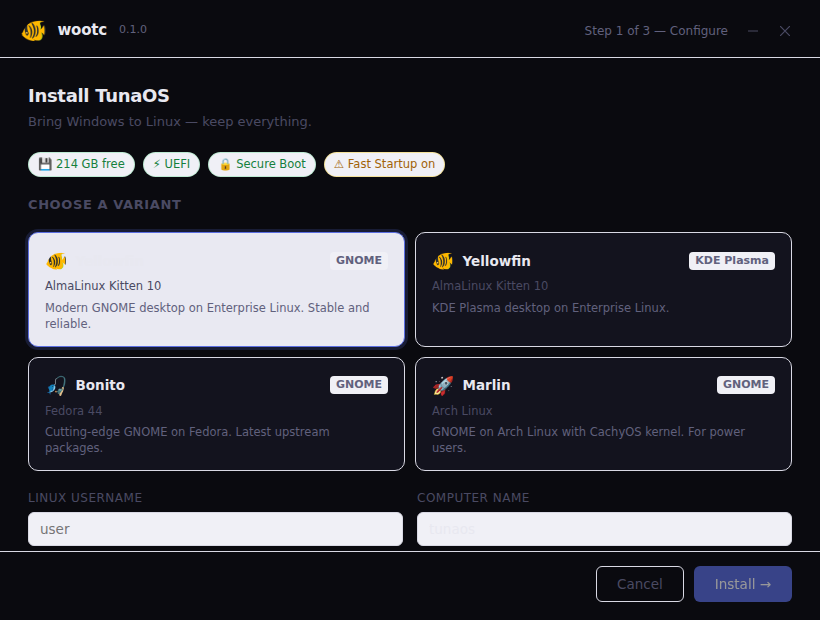
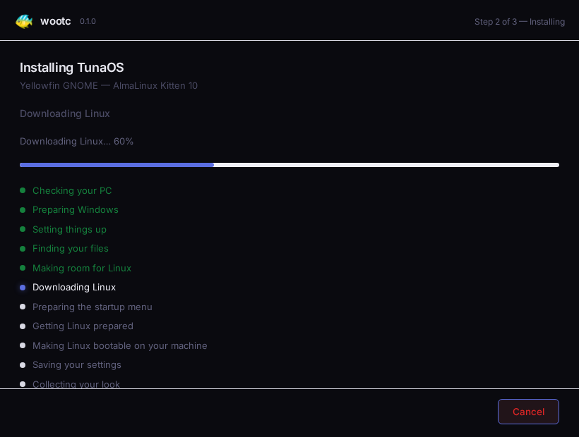

# wootc User Guide

wootc can install Linux in a disk file beside Windows.
The current installer prepares a native Linux boot after a restart.
The intended Phase 1 will run Linux inside Windows first.
That complete VM journey remains under development.

Windows remains the default boot choice during the native install path.
The installer changes boot entries, boot files, and Windows power settings.
Some storage choices also change partitions. Read the proposed plan before you continue.

This guide describes the current installer. See [current status](status.md) for the evidence and limits.

## Contents

1. [Is my PC ready?](#1-is-my-pc-ready)
2. [Install Linux](#2-install-linux)
3. [First boot into Linux](#3-first-boot-into-linux)
4. [Bring your stuff over](#4-bring-your-stuff-over)
5. [Try it first, commit later](#5-try-it-first-commit-later)
6. [Import from another disk or a backup](#6-import-from-another-disk-or-a-backup)
7. [Encryption & BitLocker](#7-encryption--bitlocker)
8. [Go Linux-only](#8-go-linux-only)
9. [Uninstall](#9-uninstall)
10. [Problems and recovery](#10-problems-and-recovery)

## 1. Is my PC ready?

The app checks your PC at startup. Its current requirements include:

- **Windows 10 or 11**, 64-bit, with UEFI firmware.
- **At least 35 GB of free space** on `C:` for the minimum plan.
  Linux needs 20 GB. The app reserves another 15 GB for Windows.
  You can choose a larger Linux disk if enough space is available.
- **Secure Boot can remain on.** The installer checks whether your firmware trusts its Microsoft-signed loader before it changes boot configuration.
  It stops if it cannot confirm that trust.
- **BitLocker off for the alpha install path.** The released alpha refuses an encrypted Windows drive.
  You can wait for support; the installer does not decrypt Windows for you.
  See [§7](#7-encryption--bitlocker) for the experimental design.

You do not need a bootable USB for this path.

## 2. Install Linux

Download the installer for your distribution and run it.
The generic app is `wootc.exe`. The Launchpad shows the plan:

1. **Pick a desktop.** The catalog has GNOME, KDE Plasma, Niri, and XFCE entries across several Linux bases.
   The alpha offers only its supported subset, with Bluefin LTS as the default.
   See the [release policy](RELEASING.md#alpha-now).
2. **Set a password.** The app proposes your username, computer name, disk size, and encryption choice.
   Review them under **Advanced**. You can also change the Windows look option there.
3. **“Make it feel like Windows” defaults to on.** Review this option.
   On supported Wayland desktops, the helpers transfer your wallpaper, accent, keyboard layout, and shortcuts.
   Saved Wi-Fi networks use a separate path.
4. Click **Install**. The app creates the Linux disk file and stages boot files.
   It also configures a one-time boot into the deployer and disables Fast Startup and hibernation.

Restart when you are ready. The one-time boot starts the deployer.
Windows remains the default after that entry expires.
A failed install can need recovery or cleanup. A one-time entry does not guarantee every failure returns safely.

## 3. First boot into Linux

The deployer installs the chosen image into the disk file.
Windows normally returns after that one-time boot.
Open the app again. When the Manage screen offers **Restart into &lt;distro&gt; →**, choose it to schedule a Linux boot.

Linux then boots directly from the disk file on the Windows drive.
Its bootc image provides the installed system and update mechanism.
The boot files on the Windows ESP also need their own update checks.

The boot menu includes Windows. Native installation does not remove Windows.
On the KVM E2E rig, tests passed for some native cycles. See [current status](status.md) for their limits.

## 4. Bring your stuff over

Open **Bring Over From Windows** to review migration categories.
Some preferences can transfer automatically. Other imports need your choice.
Review each category's source, destination, and limits before you import it.

The helpers cover these categories:

- **Files:** Documents, Desktop, Pictures, Downloads, Music, and Videos.
  A folder can initially share its Windows contents. Conversion makes a separate Linux copy.
- **Browsers:** Firefox imports a complete profile, which can include saved passwords.
  Chrome and Edge import bookmarks and history. Their Windows password stores need a separate sign-in path.
- **Steam:** a library bridge can use games in place, without another download.
- **Office:** the helper copies your selected styles, dictionaries, and preferences for LibreOffice.
- **Apps:** the dashboard lists apps from Windows and suggests alternatives for Linux.
- **WSL:** selected dotfiles and package lists can help rebuild your Linux tools.
- **Wi-Fi:** the helper creates NetworkManager connections from saved networks.
  Enterprise networks can need a fresh sign-in.
- **Windows look:** the helpers transfer your selected preferences and shortcuts on supported desktops.

A category's presence does not prove every account or application will transfer.
Check your files and application state on Linux before you remove any source data.
Keep your own backup. Do not assume a repeat import will preserve your later edits.

## 5. Try it first, commit later

The intended Phase 1 runs Linux inside Windows before native boot.
Current standard releases do not yet provide that complete journey.
The existing VM option needs a prepared Linux disk, QEMU, firmware, and an accelerator.
The main install path still uses the deployer after a reboot.

Do not treat “Boot in VM” as proof that no earlier reboot is necessary.
[ADR 0004](adr/0004-restore-vm-first-product.md) tracks the required VM-first path.
It must preserve your installed system and work when you later choose native boot.

## 6. Import from another disk or a backup

On Linux, **Bring Your Windows Over** can import from another Windows drive.
The source can be a second internal disk, a USB drive, or a backup.

1. **Scan** for Windows drives.
2. **Unlock** an encrypted source with your password or 48-digit recovery key.
   This import path mounts the source read-only. It does not decrypt the drive in place.
3. **Pick the user** whose files you want.
4. **Choose the categories** to import and review their destinations.

This separate import path does not open the alpha's encrypted-PC install gate.

## 7. Encryption & BitLocker

**Not yet available in the alpha:** installation on an encrypted Windows drive.

The alpha refuses to install on a BitLocker-protected Windows drive. **Editable Documents: not proven green yet.**
Experimental code and VM results do not change that release policy.
The editable Documents candidate still needs its own complete acceptance run.
See [current status](status.md) and [issue #34](https://github.com/tuna-os/wootc/issues/34).

The experimental storage plan can put Linux on an unencrypted volume while Windows retains BitLocker.
It can use another volume or propose a new partition.
A partition change needs a separate safety review; it does not have the same scope as a disk-file install.

Linux disk encryption is a separate choice:

- **TPM auto-unlock:** LUKS uses your PC's TPM to unlock the Linux disk at boot.
- **Passphrase:** you enter a password at boot.
- **None:** anyone with access to the disk can read its contents.

**One-time MOK enrollment.** Some distributions, such as Bazzite, use their own kernel key.
The installer's final screen tells you if the chosen image needs enrollment.
The blue **MOK management** screen asks for that key's approval:
**Enroll MOK** → **Continue** → **Yes**.
Use the distribution's documented enrollment password, `universalblue`, for supported images from Universal Blue.
Secure Boot remains on. A later key change can need another enrollment.

## 8. Go Linux-only

Native graduation and Windows removal are different operations.
The current execution path can graduate Linux onto a separate disk that the harness verifies as blank in the test harness.
It retains Windows and the original `root.disk`.
This proof does not establish an install onto free space on the same disk.

The helper also prints plans for an in-place move and Windows removal.
The app cannot execute those plans for normal use.
Do not treat a plan, a converted-folder marker, or a snapshot check as proof that all your data has moved.
The required safety and recovery gates remain open on the [roadmap](../ROADMAP.md).

Keep both systems until you have verified your work and a separate backup.

## 9. Uninstall

Open **Settings → Apps → Installed apps** and choose **TunaOS (wootc)**.
You can also run `wootc.exe` again as Administrator and choose **Uninstall** on the Manage screen.

The uninstaller tries to:

- Remove wootc's boot entries and owned files from the boot partition.
- Remove installer files.
- Restore the recorded Fast Startup and hibernation settings.

It keeps `root.disk` by default.
Select **Also delete my Linux data** only if you want to remove that disk file and its contents.
A dedicated volume needs additional ownership and content checks before the app offers to return its space to Windows.
If ownership or contents remain uncertain, the app preserves the partition and gives a reason.

An incomplete cleanup can leave files or boot state behind.
Read any reported errors before you retry.
Uninstall does not undo work that you made on a graduated native disk.

## 10. Problems and recovery

- **“Boot Windows once and shut down fully.”** Fast Startup or hibernation can leave the drive locked.
  Boot Windows and use a full shutdown before you retry.
- **Stuck at the boot menu:** choose **Windows Boot Manager**.
  If Windows does not start, use the recovery instructions for that failure.
- **Setup stopped and Windows started again:** open wootc.
  The recovery screen shows the boot configuration that wootc reads now.
  **Keep Windows only** removes the wootc entries from the boot order. It keeps the files, so you can try again later.
  **Repair boot** writes the installer boot files again and sets the next restart to the installer.
  wootc disables a button when it cannot prove that it owns the boot entries or files.
  From a command prompt, `wootc.exe recover --inspect` shows the same report and changes nothing.
  Each check saves its evidence in `C:\wootc\install\repair\`. Attach that folder to a bug report.
- **An import asks you to sign in:** authenticate again in the destination app.
  Browser profile transfer and account credentials have different limits.
- **No TPM:** review the passphrase and unencrypted choices under **Advanced**.
  An encryption choice does not remove the UEFI requirement.
- **Windows asks to scan a drive:** a power cut or forced shutdown can leave it unclean.
  Complete the Windows check and inspect its result. Do not assume every file survived a failed shutdown.

wootc remains early software. The tests cover some scenarios for native installation in VMs.
It does not establish complete VM-first use or real-hardware acceptance.
See the [status](status.md), [verification ladder](milestones.md), and [roadmap](../ROADMAP.md).
